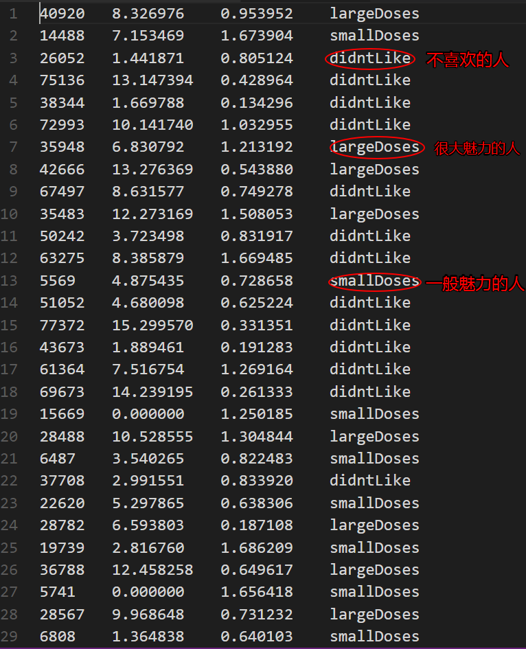
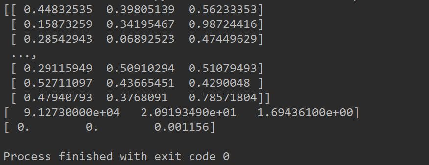

## 一、简单k-近邻算法
本文将从k-近邻算法的思想开始讲起，使用python3一步一步编写代码进行实战训练。并且，我也提供了相应的数据集，对代码进行了详细的注释。实战实例：电影类别分类、约会网站配对效果判定。

本文出现的所有代码和数据集，均可在我的github上下载，欢迎Follow、Star：[Github地址](https://github.com/yaoguangju/machine_learning)
#### 1、k-近邻法简介
k-近邻法(k-nearest neighbor, k-NN)是1967年由Cover T和Hart P提出的一种基本分类与回归方法。它的工作原理是：存在一个样本数据集合，也称作为训练样本集，并且样本集中每个数据都存在标签，即我们知道样本集中每一个数据与所属分类的对应关系。输入没有标签的新数据后，将新的数据的每个特征与样本集中数据对应的特征进行比较，然后算法提取样本最相似数据(最近邻)的分类标签。一般来说，我们只选择样本数据集中前k个最相似的数据，这就是k-近邻算法中k的出处，通常k是不大于20的整数。最后，选择k个最相似数据中出现次数最多的分类，作为新数据的分类。

举个简单的例子，我们可以使用k-近邻算法分类一个电影是爱情片还是动作片。


上表就是我们已有的数据集合，也就是训练样本集。这个数据集有两个特征，即打斗镜头数和接吻镜头数。除此之外，我们也知道每个电影的所属类型，即分类标签。用肉眼粗略地观察，接吻镜头多的，是爱情片。打斗镜头多的，是动作片。以我的经验，这个分类还算合理。如果现在给我一部电影，你告诉我这个电影打斗镜头数和接吻镜头数。不告诉我这个电影类型，我可以根据你给我的信息进行判断，这个电影是属于爱情片还是动作片。而k-近邻算法也可以像我们人一样做到这一点，不同的地方在于，我们的经验更直观，而k-近邻算法是靠已有的数据。比如，你告诉我这个电影打斗镜头数为2，接吻镜头数为102，我的经验会告诉你这个是爱情片，k-近邻算法也会告诉你这个是爱情片。再如你告诉我这个电影的打斗镜头数为78，接吻镜头数为3，我的经验会告诉你这个是动作片，同样，k-近邻算法也会告诉你这个是动作片。
当然假如你又告诉我另一个电影打斗镜头数为49，接吻镜头数为51，这个时候我们应该具体事例具体分析了，此时k-近邻算法得到的结果可能是爱情片，也可能是动作片，取决于数据集的大小以及最近邻的判断标准等因素。

#### 2、距离度量
我们已经知道k-近邻算法根据特征比较，然后提取样本集中特征最相似数据(最邻近)的分类标签。那么，如何进行比较呢？比如，我们还是以上表为例，怎么判断红色圆点标记的电影所属的类别呢？ 如下图所示


我们可以从散点图大致推断，这个红色圆点标记的电影可能属于动作片，因为距离已知的那两个动作片的圆点更近。k-近邻算法用什么方法进行判断呢？没错，就是距离度量。这个电影分类的例子有2个特征，也就是在2维实数向量空间，可以使用我们学过的两点距离公式计算距离


通过计算，我们可以得到如下结果：

- (101,20)->动作片(108,5)的距离约为16.55
- (101,20)->动作片(115,8)的距离约为18.44
- (101,20)->爱情片(5,89)的距离约为118.22
- (101,20)->爱情片(1,101)的距离约为128.69

通过计算可知，红色圆点标记的电影到动作片(108,5)的距离最近，为16.55。如果算法直接根据这个结果，判断该红色圆点标记的电影为动作片，这个算法就是最近邻算法，而非k-近邻算法。那么k-近邻算法是什么呢？k-近邻算法步骤如下：

1. 计算已知类别数据集中的点与当前点之间的距离；
2. 按照距离递增次序排序；
3. 选取与当前点距离最小的k个点；
4. 确定前k个点所在类别的出现频率；
5. 返回前k个点所出现频率最高的类别作为当前点的预测分类。

比如，现在我这个k值取3，那么在电影例子中，按距离依次排序的三个点分别是动作片(108,5)、动作片(115,8)、爱情片(5,89)。在这三个点中，动作片出现的频率为三分之二，爱情片出现的频率为三分之一，所以该红色圆点标记的电影为动作片。这个判别过程就是k-近邻算法。

#### 3、Python3代码实现

我们已经知道了k-近邻算法的原理，那么接下来就是使用Python3实现该算法，依然以电影分类为例。

###### (1)准备数据集
```python
# -*- coding: UTF-8 -*-
import numpy as np
import operator

"""
函数说明:创建数据集

Parameters:
	无
Returns:
	group - 数据集
	labels - 分类标签

"""
def createDataSet():
	#四组二维特征
	group = np.array([[1,101],[5,89],[108,5],[115,8]])
	#四组特征的标签
	labels = ['爱情片','爱情片','动作片','动作片']
	return group, labels

"""
函数说明:kNN算法,分类器

Parameters:
	inX - 用于分类的数据(测试集)
	dataSet - 用于训练的数据(训练集)
	labels - 分类标签
	k - kNN算法参数,选择距离最小的k个点
Returns:
	sortedClassCount[0][0] - 分类结果

"""
def classify0(inX, dataSet, labels, k):
	#numpy函数shape[0]返回dataSet的行数
	dataSetSize = dataSet.shape[0]
	#在列向量方向上重复inX共1次(横向)，行向量方向上重复inX共dataSetSize次(纵向)
	diffMat = np.tile(inX, (dataSetSize, 1)) - dataSet
	#二维特征相减后平方
	sqDiffMat = diffMat**2
	#sum()所有元素相加，sum(0)列相加，sum(1)行相加
	sqDistances = sqDiffMat.sum(axis=1)
	#开方，计算出距离
	distances = sqDistances**0.5
	#返回distances中元素从小到大排序后的索引值
	sortedDistIndices = distances.argsort()
	#定一个记录类别次数的字典
	classCount = {}
	for i in range(k):
		#取出前k个元素的类别
		voteIlabel = labels[sortedDistIndices[i]]
		#dict.get(key,default=None),字典的get()方法,返回指定键的值,如果值不在字典中返回默认值。
		#计算类别次数
		classCount[voteIlabel] = classCount.get(voteIlabel,0) + 1
	#python3中用items()替换python2中的iteritems()
	#key=operator.itemgetter(1)根据字典的值进行排序
	#key=operator.itemgetter(0)根据字典的键进行排序
	#reverse降序排序字典
	sortedClassCount = sorted(classCount.items(),key=operator.itemgetter(1),reverse=True)
	#返回次数最多的类别,即所要分类的类别
	return sortedClassCount[0][0]

if __name__ == '__main__':
	#创建数据集
	group, labels = createDataSet()
	#测试集
	test = [101,20]
	#kNN分类
	test_class = classify0(test, group, labels, 3)
	#打印分类结果
	print(test_class)
```
运行结果，如图所示


可以看到，分类结果根据我们的"经验"，是正确的，尽管这种分类比较耗时

到这里，也许有人早已经发现，电影例子中的特征是2维的，这样的距离度量可以用两 点距离公式计算，但是如果是更高维的呢？对，没错。我们可以用欧氏距离(也称欧几里德度量)，如下图所示。我们所学的两点距离公式就是欧氏距离在二维空间上的公式，也就是欧氏距离的n的值为2的情况。


看到这里，有人可能会问：“分类器何种情况下会出错？”或者“答案是否总是正确的？”答案是否定的，分类器并不会得到百分百正确的结果，我们可以使用多种方法检测分类器的正确率。此外分类器的性能也会受到多种因素的影响，如分类器设置和数据集等。不同的算法在不同数据集上的表现可能完全不同。为了测试分类器的效果，我们可以使用已知答案的数据，当然答案不能告诉分类器，检验分类器给出的结果是否符合预期结果。通过大量的测试数据，我们可以得到分类器的错误率-分类器给出错误结果的次数除以测试执行的总数。错误率是常用的评估方法，主要用于评估分类器在某个数据集上的执行效果。完美分类器的错误率为0，最差分类器的错误率是1.0。同时，我们也不难发现，k-近邻算法没有进行数据的训练，直接使用未知的数据与已知的数据进行比较，得到结果。因此，可以说k-近邻算法不具有显式的学习过程。

## 二、k-近邻算法实战之约会网站配对效果判定
上一小结是简单的k-近邻算法的实现方法，但是这并不是完整的k-近邻算法流程。

k-近邻算法的一般流程：

1. 收集数据：可以使用爬虫进行数据的收集，也可以使用第三方提供的免费或收费的数据。一般来讲，数据放在txt文本文件中，按照一定的格式进行存储，便于解析及处理。
2. 准备数据：使用Python解析、预处理数据。
3. 分析数据：可以使用很多方法对数据进行分析，例如使用Matplotlib将数据可视化。
4. 测试算法：计算错误率。
5. 使用算法：错误率在可接受范围内，就可以运行k-近邻算法进行分类。

下面开始进入实战内容
#### 1、实战背景
海伦女士一直使用在线约会网站寻找适合自己的约会对象。尽管约会网站会推荐不同的任选，但她并不是喜欢每一个人。经过一番总结，她发现自己交往过的人可以进行如下分类：
1. 不喜欢的人
2. 魅力一般的人
3. 极具魅力的人

海伦收集约会数据已经有了一段时间，她把这些数据存放在文本文件datingTestSet.txt中，每个样本数据占据一行，总共有1000行。datingTestSet.txt数据下载：[数据集下载](https://github.com/yaoguangju/machine_learning/blob/master/K-%E8%BF%91%E9%82%BB%E7%AE%97%E6%B3%95/2.%E6%B5%B7%E4%BC%A6%E7%BA%A6%E4%BC%9A%E7%BD%91%E7%AB%99%E9%85%8D%E5%AF%B9%E6%95%88%E6%9E%9C%E5%88%A4%E5%AE%9A/datingTestSet.txt)

海伦收集的样本数据主要包含以下3种特征：

1. 每年获得的飞行常客里程数
2. 玩视频游戏所消耗时间百分比
3. 每周消费的冰淇淋公升数

打开txt文本文件，数据格式如图所示



#### 2、准备数据：数据解析

在将上述特征数据输入到分类器前，必须将待处理的数据的格式改变为分类器可以接收的格式。分类器接收的数据是什么格式的呢？从上小结已经知道，要将数据分类两部分，即特征矩阵和对应的分类标签向量。在kNN_test02.py文件中创建名为file2matrix的函数，以此来处理输入格式问题。 将datingTestSet.txt放到与kNN_test02.py相同目录下，编写代码如下：
```python
# -*- coding: UTF-8 -*-

from matplotlib.font_manager import FontProperties
import matplotlib.lines as mlines
import matplotlib.pyplot as plt
import numpy as np
import operator


"""
函数说明:kNN算法,分类器

Parameters:
	inX - 用于分类的数据(测试集)
	dataSet - 用于训练的数据(训练集)
	labels - 分类标签
	k - kNN算法参数,选择距离最小的k个点
Returns:
	sortedClassCount[0][0] - 分类结果

"""
def classify0(inX, dataSet, labels, k):
	#numpy函数shape[0]返回dataSet的行数
	dataSetSize = dataSet.shape[0]
	#在列向量方向上重复inX共1次(横向),行向量方向上重复inX共dataSetSize次(纵向)
	diffMat = np.tile(inX, (dataSetSize, 1)) - dataSet
	#二维特征相减后平方
	sqDiffMat = diffMat**2
	#sum()所有元素相加,sum(0)列相加,sum(1)行相加
	sqDistances = sqDiffMat.sum(axis=1)
	#开方,计算出距离
	distances = sqDistances**0.5
	#返回distances中元素从小到大排序后的索引值
	sortedDistIndices = distances.argsort()
	#定一个记录类别次数的字典
	classCount = {}
	for i in range(k):
		#取出前k个元素的类别
		voteIlabel = labels[sortedDistIndices[i]]
		#dict.get(key,default=None),字典的get()方法,返回指定键的值,如果值不在字典中返回默认值。
		#计算类别次数
		classCount[voteIlabel] = classCount.get(voteIlabel,0) + 1
	#python3中用items()替换python2中的iteritems()
	#key=operator.itemgetter(1)根据字典的值进行排序
	#key=operator.itemgetter(0)根据字典的键进行排序
	#reverse降序排序字典
	sortedClassCount = sorted(classCount.items(),key=operator.itemgetter(1),reverse=True)
	print(sortedClassCount)
	#返回次数最多的类别,即所要分类的类别
	return sortedClassCount[0][0]


"""
函数说明:打开并解析文件，对数据进行分类：1代表不喜欢,2代表魅力一般,3代表极具魅力

Parameters:
	filename - 文件名
Returns:
	returnMat - 特征矩阵
	classLabelVector - 分类Label向量

"""
def file2matrix(filename):
	#打开文件
	fr = open(filename)
	#读取文件所有内容
	arrayOLines = fr.readlines()
	#得到文件行数
	numberOfLines = len(arrayOLines)
	#返回的NumPy矩阵,解析完成的数据:numberOfLines行,3列
	returnMat = np.zeros((numberOfLines,3))
	#返回的分类标签向量
	classLabelVector = []
	#行的索引值
	index = 0
	for line in arrayOLines:
		#s.strip(rm)，当rm空时,默认删除空白符(包括'\n','\r','\t',' ')
		line = line.strip()
		#使用s.split(str="",num=string,cout(str))将字符串根据'\t'分隔符进行切片。
		listFromLine = line.split('\t')
		#将数据前三列提取出来,存放到returnMat的NumPy矩阵中,也就是特征矩阵
		returnMat[index,:] = listFromLine[0:3]
		#根据文本中标记的喜欢的程度进行分类,1代表不喜欢,2代表魅力一般,3代表极具魅力
		if listFromLine[-1] == 'didntLike':
			classLabelVector.append(1)
		elif listFromLine[-1] == 'smallDoses':
			classLabelVector.append(2)
		elif listFromLine[-1] == 'largeDoses':
			classLabelVector.append(3)
		index += 1
	return returnMat, classLabelVector

if __name__ == '__main__':
	#打开的文件名
	filename = 'datingTestSet.txt'
	#打开并处理数据
	datingDataMat, datingLabels = file2matrix(filename)
	print(datingDataMat)
	print(datingLabels)

```
运行上述代码，得到的数据解析结果如图所示


可以看到，我们已经顺利导入数据，并对数据进行解析，格式化为分类器需要的数据格式。接着我们需要了解数据的真正含义。可以通过友好、直观的图形化的方式观察数据。

#### 3、分析数据：数据可视化

在kNN_test02.py文件中编写名为showdatas的函数，用来将数据可视化。编写代码如下：

```python
# -*- coding: UTF-8 -*-

from matplotlib.font_manager import FontProperties
import matplotlib.lines as mlines
import matplotlib.pyplot as plt
import numpy as np
import operator


"""
函数说明:kNN算法,分类器

Parameters:
	inX - 用于分类的数据(测试集)
	dataSet - 用于训练的数据(训练集)
	labels - 分类标签
	k - kNN算法参数,选择距离最小的k个点
Returns:
	sortedClassCount[0][0] - 分类结果

"""
def classify0(inX, dataSet, labels, k):
	#numpy函数shape[0]返回dataSet的行数
	dataSetSize = dataSet.shape[0]
	#在列向量方向上重复inX共1次(横向),行向量方向上重复inX共dataSetSize次(纵向)
	diffMat = np.tile(inX, (dataSetSize, 1)) - dataSet
	#二维特征相减后平方
	sqDiffMat = diffMat**2
	#sum()所有元素相加,sum(0)列相加,sum(1)行相加
	sqDistances = sqDiffMat.sum(axis=1)
	#开方,计算出距离
	distances = sqDistances**0.5
	#返回distances中元素从小到大排序后的索引值
	sortedDistIndices = distances.argsort()
	#定一个记录类别次数的字典
	classCount = {}
	for i in range(k):
		#取出前k个元素的类别
		voteIlabel = labels[sortedDistIndices[i]]
		#dict.get(key,default=None),字典的get()方法,返回指定键的值,如果值不在字典中返回默认值。
		#计算类别次数
		classCount[voteIlabel] = classCount.get(voteIlabel,0) + 1
	#python3中用items()替换python2中的iteritems()
	#key=operator.itemgetter(1)根据字典的值进行排序
	#key=operator.itemgetter(0)根据字典的键进行排序
	#reverse降序排序字典
	sortedClassCount = sorted(classCount.items(),key=operator.itemgetter(1),reverse=True)
	print(sortedClassCount)
	#返回次数最多的类别,即所要分类的类别
	return sortedClassCount[0][0]


"""
函数说明:打开并解析文件，对数据进行分类：1代表不喜欢,2代表魅力一般,3代表极具魅力

Parameters:
	filename - 文件名
Returns:
	returnMat - 特征矩阵
	classLabelVector - 分类Label向量

"""
def file2matrix(filename):
	#打开文件
	fr = open(filename)
	#读取文件所有内容
	arrayOLines = fr.readlines()
	#得到文件行数
	numberOfLines = len(arrayOLines)
	#返回的NumPy矩阵,解析完成的数据:numberOfLines行,3列
	returnMat = np.zeros((numberOfLines,3))
	#返回的分类标签向量
	classLabelVector = []
	#行的索引值
	index = 0
	for line in arrayOLines:
		#s.strip(rm)，当rm空时,默认删除空白符(包括'\n','\r','\t',' ')
		line = line.strip()
		#使用s.split(str="",num=string,cout(str))将字符串根据'\t'分隔符进行切片。
		listFromLine = line.split('\t')
		#将数据前三列提取出来,存放到returnMat的NumPy矩阵中,也就是特征矩阵
		returnMat[index,:] = listFromLine[0:3]
		#根据文本中标记的喜欢的程度进行分类,1代表不喜欢,2代表魅力一般,3代表极具魅力
		if listFromLine[-1] == 'didntLike':
			classLabelVector.append(1)
		elif listFromLine[-1] == 'smallDoses':
			classLabelVector.append(2)
		elif listFromLine[-1] == 'largeDoses':
			classLabelVector.append(3)
		index += 1
	return returnMat, classLabelVector

"""
函数说明:可视化数据

Parameters:
	datingDataMat - 特征矩阵
	datingLabels - 分类Label
Returns:
	无
"""
def showdatas(datingDataMat, datingLabels):
	#设置汉字格式
	font = FontProperties(fname=r"c:\windows\fonts\simsun.ttc", size=14)
	#将fig画布分隔成1行1列,不共享x轴和y轴,fig画布的大小为(13,8)
	#当nrow=2,nclos=2时,代表fig画布被分为四个区域,axs[0][0]表示第一行第一个区域
	fig, axs = plt.subplots(nrows=2, ncols=2,sharex=False, sharey=False, figsize=(13,8))

	numberOfLabels = len(datingLabels)
	LabelsColors = []
	for i in datingLabels:
		if i == 1:
			LabelsColors.append('black')
		if i == 2:
			LabelsColors.append('orange')
		if i == 3:
			LabelsColors.append('red')
	#画出散点图,以datingDataMat矩阵的第一(飞行常客例程)、第二列(玩游戏)数据画散点数据,散点大小为15,透明度为0.5
	axs[0][0].scatter(x=datingDataMat[:,0], y=datingDataMat[:,1], color=LabelsColors,s=15, alpha=.5)
	#设置标题,x轴label,y轴label
	axs0_title_text = axs[0][0].set_title(u'每年获得的飞行常客里程数与玩视频游戏所消耗时间占比',FontProperties=font)
	axs0_xlabel_text = axs[0][0].set_xlabel(u'每年获得的飞行常客里程数',FontProperties=font)
	axs0_ylabel_text = axs[0][0].set_ylabel(u'玩视频游戏所消耗时间占比',FontProperties=font)
	plt.setp(axs0_title_text, size=9, weight='bold', color='red')
	plt.setp(axs0_xlabel_text, size=7, weight='bold', color='black')
	plt.setp(axs0_ylabel_text, size=7, weight='bold', color='black')

	#画出散点图,以datingDataMat矩阵的第一(飞行常客例程)、第三列(冰激凌)数据画散点数据,散点大小为15,透明度为0.5
	axs[0][1].scatter(x=datingDataMat[:,0], y=datingDataMat[:,2], color=LabelsColors,s=15, alpha=.5)
	#设置标题,x轴label,y轴label
	axs1_title_text = axs[0][1].set_title(u'每年获得的飞行常客里程数与每周消费的冰激淋公升数',FontProperties=font)
	axs1_xlabel_text = axs[0][1].set_xlabel(u'每年获得的飞行常客里程数',FontProperties=font)
	axs1_ylabel_text = axs[0][1].set_ylabel(u'每周消费的冰激淋公升数',FontProperties=font)
	plt.setp(axs1_title_text, size=9, weight='bold', color='red')
	plt.setp(axs1_xlabel_text, size=7, weight='bold', color='black')
	plt.setp(axs1_ylabel_text, size=7, weight='bold', color='black')

	#画出散点图,以datingDataMat矩阵的第二(玩游戏)、第三列(冰激凌)数据画散点数据,散点大小为15,透明度为0.5
	axs[1][0].scatter(x=datingDataMat[:,1], y=datingDataMat[:,2], color=LabelsColors,s=15, alpha=.5)
	#设置标题,x轴label,y轴label
	axs2_title_text = axs[1][0].set_title(u'玩视频游戏所消耗时间占比与每周消费的冰激淋公升数',FontProperties=font)
	axs2_xlabel_text = axs[1][0].set_xlabel(u'玩视频游戏所消耗时间占比',FontProperties=font)
	axs2_ylabel_text = axs[1][0].set_ylabel(u'每周消费的冰激淋公升数',FontProperties=font)
	plt.setp(axs2_title_text, size=9, weight='bold', color='red')
	plt.setp(axs2_xlabel_text, size=7, weight='bold', color='black')
	plt.setp(axs2_ylabel_text, size=7, weight='bold', color='black')
	#设置图例
	didntLike = mlines.Line2D([], [], color='black', marker='.',
                      markersize=6, label='didntLike')
	smallDoses = mlines.Line2D([], [], color='orange', marker='.',
	                  markersize=6, label='smallDoses')
	largeDoses = mlines.Line2D([], [], color='red', marker='.',
	                  markersize=6, label='largeDoses')
	#添加图例
	axs[0][0].legend(handles=[didntLike,smallDoses,largeDoses])
	axs[0][1].legend(handles=[didntLike,smallDoses,largeDoses])
	axs[1][0].legend(handles=[didntLike,smallDoses,largeDoses])
	#显示图片
	plt.show()

if __name__ == '__main__':
	#打开的文件名
	filename = 'datingTestSet.txt'
	#打开并处理数据
	datingDataMat, datingLabels = file2matrix(filename)
	showdatas(datingDataMat, datingLabels)
```


通过数据可以很直观的发现数据的规律，比如以玩游戏所消耗时间占比与每年获得的飞行常客里程数，只考虑这二维的特征信息，给我的感觉就是海伦喜欢有生活质量的男人。为什么这么说呢？每年获得的飞行常客里程数表明，海伦喜欢能享受飞行常客奖励计划的男人，但是不能经常坐飞机，疲于奔波，满世界飞。同时，这个男人也要玩视频游戏，并且占一定时间比例。能到处飞，又能经常玩游戏的男人是什么样的男人？很显然，有生活质量，并且生活悠闲的人。我的分析，仅仅是通过可视化的数据总结的个人看法。我想，每个人的感受应该也是不尽相同。

#### 4、准备数据：数据归一化

下表给出了四组样本，如果想要计算样本3和样本4之间的距离，可以使用欧拉公式计算。


计算方法如下图所示


我们很容易发现，上面方程中数字差值最大的属性对计算结果的影响最大，也就是说，每年获取的飞行常客里程数对于计算结果的影响将远远大于表2.1中其他两个特征-玩视频游戏所耗时间占比和每周消费冰淇淋公斤数的影响。而产生这种现象的唯一原因，仅仅是因为飞行常客里程数远大于其他特征值。但海伦认为这三种特征是同等重要的，因此作为三个等权重的特征之一，飞行常客里程数并不应该如此严重地影响到计算结果。

在处理这种不同取值范围的特征值时，我们通常采用的方法是将数值归一化，如将取值范围处理为０到１或者-１到１之间。下面的公式可以将任意取值范围的特征值转化为０到１区间内的值：

**newValue = (oldValue - min) / (max - min)**

其中min和max分别是数据集中的最小特征值和最大特征值。虽然改变数值取值范围增加了分类器的复杂度，但为了得到准确结果，我们必须这样做。在kNN_test02.py文件中编写名为autoNorm的函数，用该函数自动将数据归一化。代码如下：
```python
# -*- coding: UTF-8 -*-

from matplotlib.font_manager import FontProperties
import matplotlib.lines as mlines
import matplotlib.pyplot as plt
import numpy as np
import operator

"""
函数说明:kNN算法,分类器

Parameters:
	inX - 用于分类的数据(测试集)
	dataSet - 用于训练的数据(训练集)
	labels - 分类标签
	k - kNN算法参数,选择距离最小的k个点
Returns:
	sortedClassCount[0][0] - 分类结果

"""
def classify0(inX, dataSet, labels, k):
	#numpy函数shape[0]返回dataSet的行数
	dataSetSize = dataSet.shape[0]
	#在列向量方向上重复inX共1次(横向),行向量方向上重复inX共dataSetSize次(纵向)
	diffMat = np.tile(inX, (dataSetSize, 1)) - dataSet
	#二维特征相减后平方
	sqDiffMat = diffMat**2
	#sum()所有元素相加,sum(0)列相加,sum(1)行相加
	sqDistances = sqDiffMat.sum(axis=1)
	#开方,计算出距离
	distances = sqDistances**0.5
	#返回distances中元素从小到大排序后的索引值
	sortedDistIndices = distances.argsort()
	#定一个记录类别次数的字典
	classCount = {}
	for i in range(k):
		#取出前k个元素的类别
		voteIlabel = labels[sortedDistIndices[i]]
		#dict.get(key,default=None),字典的get()方法,返回指定键的值,如果值不在字典中返回默认值。
		#计算类别次数
		classCount[voteIlabel] = classCount.get(voteIlabel,0) + 1
	#python3中用items()替换python2中的iteritems()
	#key=operator.itemgetter(1)根据字典的值进行排序
	#key=operator.itemgetter(0)根据字典的键进行排序
	#reverse降序排序字典
	sortedClassCount = sorted(classCount.items(),key=operator.itemgetter(1),reverse=True)
	print(sortedClassCount)
	#返回次数最多的类别,即所要分类的类别
	return sortedClassCount[0][0]

"""
函数说明:打开并解析文件，对数据进行分类：1代表不喜欢,2代表魅力一般,3代表极具魅力

Parameters:
	filename - 文件名
Returns:
	returnMat - 特征矩阵
	classLabelVector - 分类Label向量

"""
def file2matrix(filename):
	#打开文件
	fr = open(filename)
	#读取文件所有内容
	arrayOLines = fr.readlines()
	#得到文件行数
	numberOfLines = len(arrayOLines)
	#返回的NumPy矩阵,解析完成的数据:numberOfLines行,3列
	returnMat = np.zeros((numberOfLines,3))
	#返回的分类标签向量
	classLabelVector = []
	#行的索引值
	index = 0
	for line in arrayOLines:
		#s.strip(rm)，当rm空时,默认删除空白符(包括'\n','\r','\t',' ')
		line = line.strip()
		#使用s.split(str="",num=string,cout(str))将字符串根据'\t'分隔符进行切片。
		listFromLine = line.split('\t')
		#将数据前三列提取出来,存放到returnMat的NumPy矩阵中,也就是特征矩阵
		returnMat[index,:] = listFromLine[0:3]
		#根据文本中标记的喜欢的程度进行分类,1代表不喜欢,2代表魅力一般,3代表极具魅力
		if listFromLine[-1] == 'didntLike':
			classLabelVector.append(1)
		elif listFromLine[-1] == 'smallDoses':
			classLabelVector.append(2)
		elif listFromLine[-1] == 'largeDoses':
			classLabelVector.append(3)
		index += 1
	return returnMat, classLabelVector

"""
函数说明:对数据进行归一化

Parameters:
	dataSet - 特征矩阵
Returns:
	normDataSet - 归一化后的特征矩阵
	ranges - 数据范围
	minVals - 数据最小值

"""
def autoNorm(dataSet):
	#获得数据的最小值
	minVals = dataSet.min(0)
	maxVals = dataSet.max(0)
	#最大值和最小值的范围
	ranges = maxVals - minVals
	#shape(dataSet)返回dataSet的矩阵行列数
	normDataSet = np.zeros(np.shape(dataSet))
	#返回dataSet的行数
	m = dataSet.shape[0]
	#原始值减去最小值
	normDataSet = dataSet - np.tile(minVals, (m, 1))
	#除以最大和最小值的差,得到归一化数据
	normDataSet = normDataSet / np.tile(ranges, (m, 1))
	#返回归一化数据结果,数据范围,最小值
	return normDataSet, ranges, minVals

"""
函数说明:main函数

Parameters:
	无
Returns:
	无

"""
if __name__ == '__main__':
	#打开的文件名
	filename = 'datingTestSet.txt'
	#打开并处理数据
	datingDataMat, datingLabels = file2matrix(filename)
	normDataSet, ranges, minVals = autoNorm(datingDataMat)
	print(normDataSet)
	print(ranges)
	print(minVals)

```
运行上述代码，得到结果如下图所示



从图的运行结果可以看到，已经顺利将数据归一化了，并且求出了数据的取值范围和数据的最小值，这两个值是在分类的时候需要用到的，直接先求解出来，也算是对数据预处理了。

#### 5、测试算法：验证分类器
机器学习算法一个很重要的工作就是评估算法的正确率，通常我们只提供已有数据的90%作为训练样本来训练分类器，而使用其余的10%数据去测试分类器，检测分类器的正确率。需要注意的是，10%的测试数据应该是随机选择的，由于海伦提供的数据并没有按照特定目的来排序，所以我们可以随意选择10%数据而不影响其随机性。

为了测试分类器效果，在kNN_test02.py文件中创建函数datingClassTest，编写代码如下：
```python
# -*- coding: UTF-8 -*-

from matplotlib.font_manager import FontProperties
import matplotlib.lines as mlines
import matplotlib.pyplot as plt
import numpy as np
import operator


"""
函数说明:kNN算法,分类器

Parameters:
	inX - 用于分类的数据(测试集)
	dataSet - 用于训练的数据(训练集)
	labels - 分类标签
	k - kNN算法参数,选择距离最小的k个点
Returns:
	sortedClassCount[0][0] - 分类结果

"""
def classify0(inX, dataSet, labels, k):
	#numpy函数shape[0]返回dataSet的行数
	dataSetSize = dataSet.shape[0]
	#在列向量方向上重复inX共1次(横向),行向量方向上重复inX共dataSetSize次(纵向)
	diffMat = np.tile(inX, (dataSetSize, 1)) - dataSet
	#二维特征相减后平方
	sqDiffMat = diffMat**2
	#sum()所有元素相加,sum(0)列相加,sum(1)行相加
	sqDistances = sqDiffMat.sum(axis=1)
	#开方,计算出距离
	distances = sqDistances**0.5
	#返回distances中元素从小到大排序后的索引值
	sortedDistIndices = distances.argsort()
	#定一个记录类别次数的字典
	classCount = {}
	for i in range(k):
		#取出前k个元素的类别
		voteIlabel = labels[sortedDistIndices[i]]
		#dict.get(key,default=None),字典的get()方法,返回指定键的值,如果值不在字典中返回默认值。
		#计算类别次数
		classCount[voteIlabel] = classCount.get(voteIlabel,0) + 1
	#python3中用items()替换python2中的iteritems()
	#key=operator.itemgetter(1)根据字典的值进行排序
	#key=operator.itemgetter(0)根据字典的键进行排序
	#reverse降序排序字典
	sortedClassCount = sorted(classCount.items(),key=operator.itemgetter(1),reverse=True)
	# print(sortedClassCount)
	#返回次数最多的类别,即所要分类的类别
	return sortedClassCount[0][0]


"""
函数说明:打开并解析文件，对数据进行分类：1代表不喜欢,2代表魅力一般,3代表极具魅力

Parameters:
	filename - 文件名
Returns:
	returnMat - 特征矩阵
	classLabelVector - 分类Label向量

"""
def file2matrix(filename):
	#打开文件
	fr = open(filename)
	#读取文件所有内容
	arrayOLines = fr.readlines()
	#得到文件行数
	numberOfLines = len(arrayOLines)
	#返回的NumPy矩阵,解析完成的数据:numberOfLines行,3列
	returnMat = np.zeros((numberOfLines,3))
	#返回的分类标签向量
	classLabelVector = []
	#行的索引值
	index = 0
	for line in arrayOLines:
		#s.strip(rm)，当rm空时,默认删除空白符(包括'\n','\r','\t',' ')
		line = line.strip()
		#使用s.split(str="",num=string,cout(str))将字符串根据'\t'分隔符进行切片。
		listFromLine = line.split('\t')
		#将数据前三列提取出来,存放到returnMat的NumPy矩阵中,也就是特征矩阵
		returnMat[index,:] = listFromLine[0:3]
		#根据文本中标记的喜欢的程度进行分类,1代表不喜欢,2代表魅力一般,3代表极具魅力
		if listFromLine[-1] == 'didntLike':
			classLabelVector.append(1)
		elif listFromLine[-1] == 'smallDoses':
			classLabelVector.append(2)
		elif listFromLine[-1] == 'largeDoses':
			classLabelVector.append(3)
		index += 1
	return returnMat, classLabelVector

"""
函数说明:对数据进行归一化

Parameters:
	dataSet - 特征矩阵
Returns:
	normDataSet - 归一化后的特征矩阵
	ranges - 数据范围
	minVals - 数据最小值

"""
def autoNorm(dataSet):
	#获得数据的最小值
	minVals = dataSet.min(0)
	maxVals = dataSet.max(0)
	#最大值和最小值的范围
	ranges = maxVals - minVals
	#shape(dataSet)返回dataSet的矩阵行列数
	normDataSet = np.zeros(np.shape(dataSet))
	#返回dataSet的行数
	m = dataSet.shape[0]
	#原始值减去最小值
	normDataSet = dataSet - np.tile(minVals, (m, 1))
	#除以最大和最小值的差,得到归一化数据
	normDataSet = normDataSet / np.tile(ranges, (m, 1))
	#返回归一化数据结果,数据范围,最小值
	return normDataSet, ranges, minVals


"""
函数说明:分类器测试函数

Parameters:
	无
Returns:
	normDataSet - 归一化后的特征矩阵
	ranges - 数据范围
	minVals - 数据最小值

"""
def datingClassTest():
	#打开的文件名
	filename = "datingTestSet.txt"
	#将返回的特征矩阵和分类向量分别存储到datingDataMat和datingLabels中
	datingDataMat, datingLabels = file2matrix(filename)
	#取所有数据的百分之十
	hoRatio = 0.10
	#数据归一化,返回归一化后的矩阵,数据范围,数据最小值
	normMat, ranges, minVals = autoNorm(datingDataMat)
	#获得normMat的行数
	m = normMat.shape[0]
	#百分之十的测试数据的个数
	numTestVecs = int(m * hoRatio)
	#分类错误计数
	errorCount = 0.0

	for i in range(numTestVecs):
		#前numTestVecs个数据作为测试集,后m-numTestVecs个数据作为训练集
		classifierResult = classify0(normMat[i,:], normMat[numTestVecs:m,:],
			datingLabels[numTestVecs:m], 4)
		print("分类结果:%s\t真实类别:%d" % (classifierResult, datingLabels[i]))
		if classifierResult != datingLabels[i]:
			errorCount += 1.0
	print("错误率:%f%%" %(errorCount/float(numTestVecs)*100))

"""
函数说明:main函数

Parameters:
	无
Returns:
	无

"""
if __name__ == '__main__':
	datingClassTest()
```
运行上述代码，得到结果如图所示。


从图验证分类器结果中可以看出，错误率是4%，这是一个很好的结果。我们可以改变函数datingClassTest内变量hoRatio和分类器k的值，检测错误率是否随着变量值的变化而增加。依赖于分类算法、数据集和程序设置，分类器的输出结果可能有很大的不同。

#### 6、使用算法：构建完整可用系统
我们可以给海伦一个小段程序，通过该程序海伦会在约会网站上找到某个人并输入他的信息。程序会给出她对男方喜欢程度的预测值。

在kNN_test02.py文件中创建函数classifyPerson，代码如下：
```python
# -*- coding: UTF-8 -*-

from matplotlib.font_manager import FontProperties
import matplotlib.lines as mlines
import matplotlib.pyplot as plt
import numpy as np
import operator


"""
函数说明:kNN算法,分类器

Parameters:
	inX - 用于分类的数据(测试集)
	dataSet - 用于训练的数据(训练集)
	labels - 分类标签
	k - kNN算法参数,选择距离最小的k个点
Returns:
	sortedClassCount[0][0] - 分类结果

"""
def classify0(inX, dataSet, labels, k):
	#numpy函数shape[0]返回dataSet的行数
	dataSetSize = dataSet.shape[0]
	#在列向量方向上重复inX共1次(横向),行向量方向上重复inX共dataSetSize次(纵向)
	diffMat = np.tile(inX, (dataSetSize, 1)) - dataSet
	#二维特征相减后平方
	sqDiffMat = diffMat**2
	#sum()所有元素相加,sum(0)列相加,sum(1)行相加
	sqDistances = sqDiffMat.sum(axis=1)
	#开方,计算出距离
	distances = sqDistances**0.5
	#返回distances中元素从小到大排序后的索引值
	sortedDistIndices = distances.argsort()
	#定一个记录类别次数的字典
	classCount = {}
	for i in range(k):
		#取出前k个元素的类别
		voteIlabel = labels[sortedDistIndices[i]]
		#dict.get(key,default=None),字典的get()方法,返回指定键的值,如果值不在字典中返回默认值。
		#计算类别次数
		classCount[voteIlabel] = classCount.get(voteIlabel,0) + 1
	#python3中用items()替换python2中的iteritems()
	#key=operator.itemgetter(1)根据字典的值进行排序
	#key=operator.itemgetter(0)根据字典的键进行排序
	#reverse降序排序字典
	sortedClassCount = sorted(classCount.items(),key=operator.itemgetter(1),reverse=True)
	# print(sortedClassCount)
	#返回次数最多的类别,即所要分类的类别
	return sortedClassCount[0][0]


"""
函数说明:打开并解析文件，对数据进行分类：1代表不喜欢,2代表魅力一般,3代表极具魅力

Parameters:
	filename - 文件名
Returns:
	returnMat - 特征矩阵
	classLabelVector - 分类Label向量

"""
def file2matrix(filename):
	#打开文件
	fr = open(filename)
	#读取文件所有内容
	arrayOLines = fr.readlines()
	#得到文件行数
	numberOfLines = len(arrayOLines)
	#返回的NumPy矩阵,解析完成的数据:numberOfLines行,3列
	returnMat = np.zeros((numberOfLines,3))
	#返回的分类标签向量
	classLabelVector = []
	#行的索引值
	index = 0
	for line in arrayOLines:
		#s.strip(rm)，当rm空时,默认删除空白符(包括'\n','\r','\t',' ')
		line = line.strip()
		#使用s.split(str="",num=string,cout(str))将字符串根据'\t'分隔符进行切片。
		listFromLine = line.split('\t')
		#将数据前三列提取出来,存放到returnMat的NumPy矩阵中,也就是特征矩阵
		returnMat[index,:] = listFromLine[0:3]
		#根据文本中标记的喜欢的程度进行分类,1代表不喜欢,2代表魅力一般,3代表极具魅力
		if listFromLine[-1] == 'didntLike':
			classLabelVector.append(1)
		elif listFromLine[-1] == 'smallDoses':
			classLabelVector.append(2)
		elif listFromLine[-1] == 'largeDoses':
			classLabelVector.append(3)
		index += 1
	return returnMat, classLabelVector

"""
函数说明:对数据进行归一化

Parameters:
	dataSet - 特征矩阵
Returns:
	normDataSet - 归一化后的特征矩阵
	ranges - 数据范围
	minVals - 数据最小值

"""
def autoNorm(dataSet):
	#获得数据的最小值
	minVals = dataSet.min(0)
	maxVals = dataSet.max(0)
	#最大值和最小值的范围
	ranges = maxVals - minVals
	#shape(dataSet)返回dataSet的矩阵行列数
	normDataSet = np.zeros(np.shape(dataSet))
	#返回dataSet的行数
	m = dataSet.shape[0]
	#原始值减去最小值
	normDataSet = dataSet - np.tile(minVals, (m, 1))
	#除以最大和最小值的差,得到归一化数据
	normDataSet = normDataSet / np.tile(ranges, (m, 1))
	#返回归一化数据结果,数据范围,最小值
	return normDataSet, ranges, minVals


"""
函数说明:分类器测试函数

Parameters:
	无
Returns:
	normDataSet - 归一化后的特征矩阵
	ranges - 数据范围
	minVals - 数据最小值

"""
def datingClassTest():
	#打开的文件名
	filename = "datingTestSet.txt"
	#将返回的特征矩阵和分类向量分别存储到datingDataMat和datingLabels中
	datingDataMat, datingLabels = file2matrix(filename)
	#取所有数据的百分之十
	hoRatio = 0.10
	#数据归一化,返回归一化后的矩阵,数据范围,数据最小值
	normMat, ranges, minVals = autoNorm(datingDataMat)
	#获得normMat的行数
	m = normMat.shape[0]
	#百分之十的测试数据的个数
	numTestVecs = int(m * hoRatio)
	#分类错误计数
	errorCount = 0.0

	for i in range(numTestVecs):
		#前numTestVecs个数据作为测试集,后m-numTestVecs个数据作为训练集
		classifierResult = classify0(normMat[i,:], normMat[numTestVecs:m,:],
			datingLabels[numTestVecs:m], 4)
		print("分类结果:%s\t真实类别:%d" % (classifierResult, datingLabels[i]))
		if classifierResult != datingLabels[i]:
			errorCount += 1.0
	print("错误率:%f%%" %(errorCount/float(numTestVecs)*100))

"""
函数说明:通过输入一个人的三维特征,进行分类输出

Parameters:
	无
Returns:
	无

"""
def classifyPerson():
	#输出结果
	resultList = ['讨厌','有些喜欢','非常喜欢']
	#三维特征用户输入
	precentTats = float(input("玩视频游戏所耗时间百分比:"))
	ffMiles = float(input("每年获得的飞行常客里程数:"))
	iceCream = float(input("每周消费的冰激淋公升数:"))
	#打开的文件名
	filename = "datingTestSet.txt"
	#打开并处理数据
	datingDataMat, datingLabels = file2matrix(filename)
	#训练集归一化
	normMat, ranges, minVals = autoNorm(datingDataMat)
	#生成NumPy数组,测试集
	inArr = np.array([ffMiles, precentTats, iceCream])
	#测试集归一化
	norminArr = (inArr - minVals) / ranges
	#返回分类结果
	classifierResult = classify0(norminArr, normMat, datingLabels, 3)
	#打印结果
	print("你可能%s这个人" % (resultList[classifierResult-1]))

"""
函数说明:main函数

Parameters:
	无
Returns:
	无

"""
if __name__ == '__main__':
	datingClassTest()
```
运行程序，并输入数据(12,44000,0.5)，预测结果是"你可能有些喜欢这个人"，也就是这个人魅力一般。一共有三个档次：讨厌、有些喜欢、非常喜欢，对应着不喜欢的人、魅力一般的人、极具魅力的人。结果如下图所示


## 三、总结
#### 1、kNN算法的优缺点
优点

- 简单好用，容易理解，精度高，理论成熟，既可以用来做分类也可以用来做回归；
- 可用于数值型数据和离散型数据；
- 训练时间复杂度为O(n)；无数据输入假定；
- 对异常值不敏感

缺点

- 计算复杂性高；空间复杂性高；
- 样本不平衡问题（即有些类别的样本数量很多，而其它样本的数量很少）；
- 一般数值很大的时候不用这个，计算量太大。但是单个样本又不能太少，否则容易发生误分。
- 最大的缺点是无法给出数据的内在含义。

#### 2、其他

- 如有问题，请留言。如有错误，还望指正，谢谢！

PS： 如果觉得本篇本章对您有所帮助，欢迎关注、评论、赞！

## 参考资料：

本文中提到的电影类别分类、约会网站配对效果判定，均来自于《机器学习实战》的第二章k-近邻算法。
本文的理论部分，参考《机器学习实战》的第二章k-近邻算法。