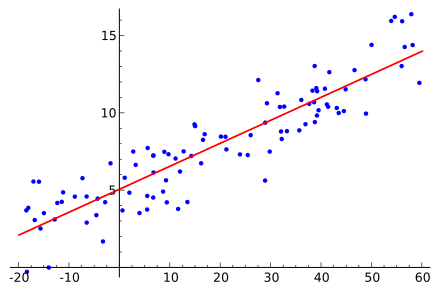
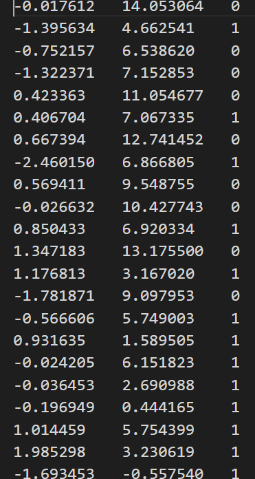
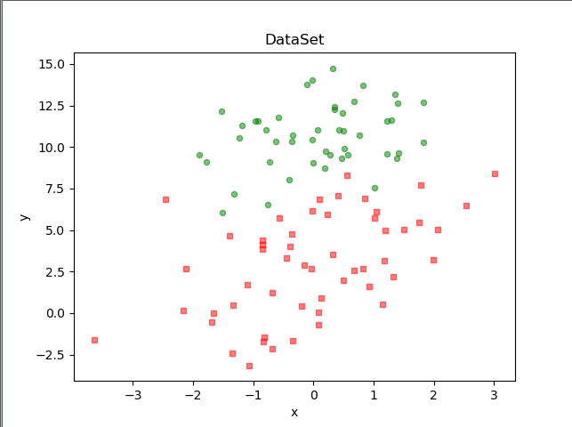
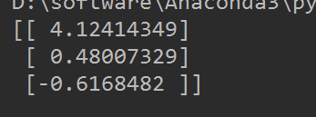
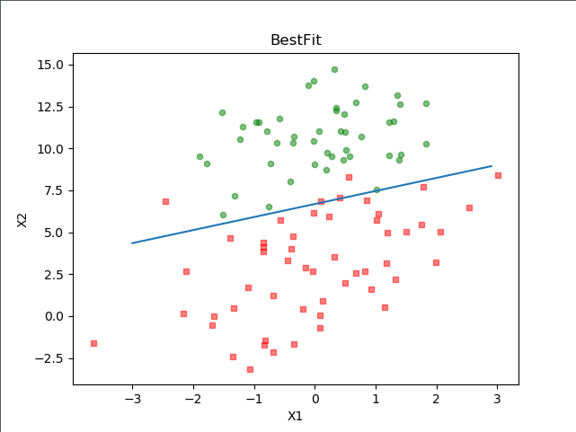
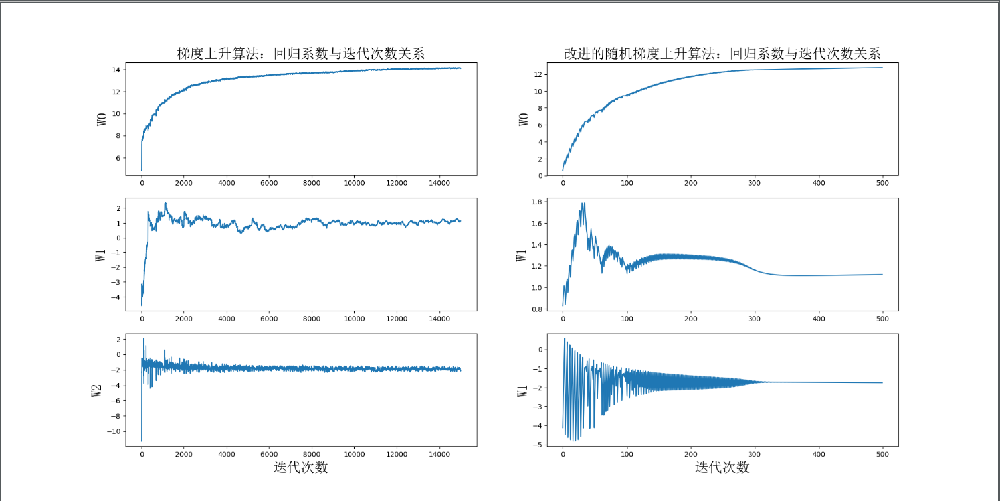
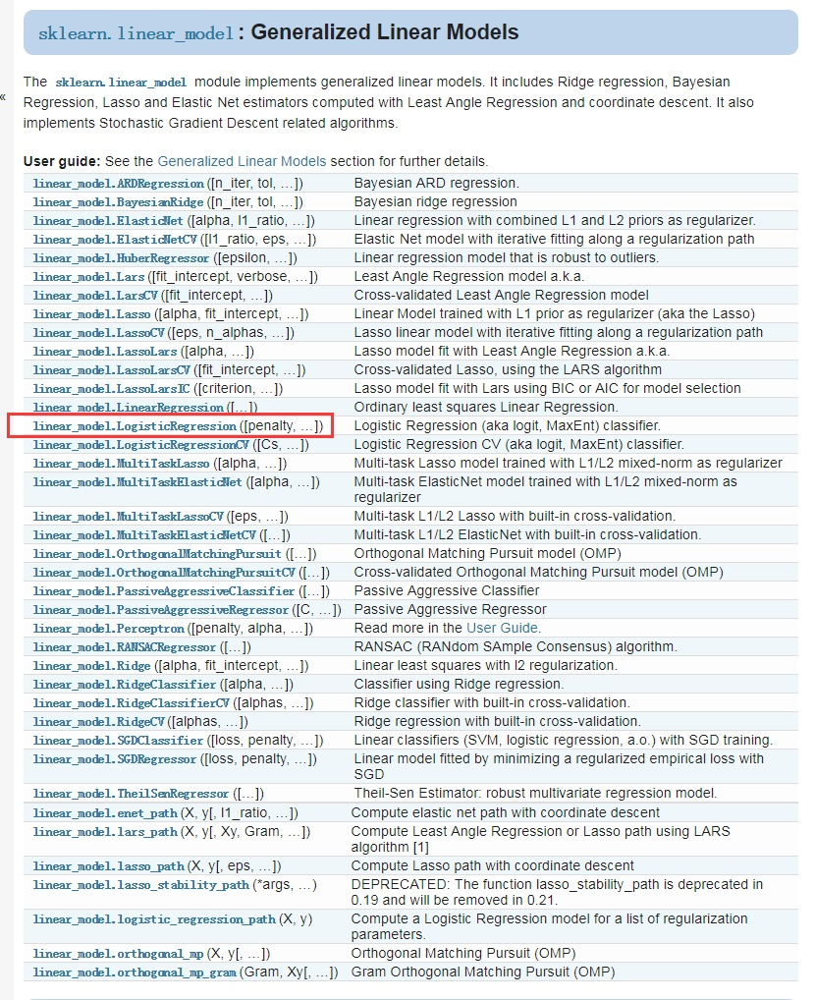
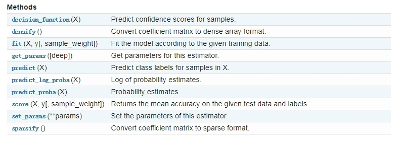

## 一、前言
---
本文从Logistic回归的原理开始讲起，并结合疝气病症状预测病马的死亡率这个实例进行实战演练。

本文出现的所有代码，均可在我的github上下载，欢迎Follow、Star：[Github地址](https://github.com/yaoguangju/machine_learning)

## 二、Logistic回归与梯度上升算法
---
Logistic回归是众多回归算法中的一员。回归算法有很多，比如：线性回归、Logistic回归、多项式回归、逐步回归、岭回归、Lasso回归等。我们常用Logistic回归模型做预测。通常，Logistic回归用于二分类问题，例如预测明天是否会下雨。当然它也可以用于多分类问题，不过为了简单起见，本文暂先讨论二分类问题。首先，让我们来了解一下，什么是Logistic回归。

#### 1、Logistic回归
假设现在有一些数据点，我们利用一条直线对这些点进行拟合(该线称为最佳拟合直线)，这个拟合过程就称作为回归，如下图所示：



Logistic回归是回归的一种方法，它利用的是Sigmoid函数阈值在[0,1]这个特性。Logistic回归进行分类的主要思想是：根据现有数据对分类边界线建立回归公式，以此进行分类。其实，Logistic本质上是一个基于条件概率的判别模型(Discriminative Model)。

所以要想了解Logistic回归，我们必须先看一看Sigmoid函数 ，我们也可以称它为Logistic函数。它的公式如下：


整合成一个公式，就变成了如下公式：


下面这张图片，为我们展示了Sigmoid函数的样子。


z是一个矩阵，θ是参数列向量(要求解的)，x是样本列向量(给定的数据集)。θ^T表示θ的转置。g(z)函数实现了任意实数到[0,1]的映射，这样我们的数据集([x0,x1,...,xn])，不管是大于1或者小于0，都可以映射到[0,1]区间进行分类。hθ(x)给出了输出为1的概率。比如当hθ(x)=0.7，那么说明有70%的概率输出为1。输出为0的概率是输出为1的补集，也就是30%。

如果我们有合适的参数列向量θ([θ0,θ1,...θn]^T)，以及样本列向量x([x0,x1,...,xn])，那么我们对样本x分类就可以通过上述公式计算出一个概率，如果这个概率大于0.5，我们就可以说样本是正样本，否则样本是负样本。

举个例子，对于"垃圾邮件判别问题"，对于给定的邮件(样本)，我们定义非垃圾邮件为正类，垃圾邮件为负类。我们通过计算出的概率值即可判定邮件是否是垃圾邮件。

那么问题来了！如何得到合适的参数向量θ?

根据sigmoid函数的特性，我们可以做出如下的假设：


式即为在已知样本x和参数θ的情况下，样本x属性正样本(y=1)和负样本(y=0)的条件概率。理想状态下，根据上述公式，求出各个点的概率均为1，也就是完全分类都正确。但是考虑到实际情况，样本点的概率越接近于1，其分类效果越好。比如一个样本属于正样本的概率为0.51，那么我们就可以说明这个样本属于正样本。另一个样本属于正样本的概率为0.99，那么我们也可以说明这个样本属于正样本。但是显然，第二个样本概率更高，更具说服力。我们可以把上述两个概率公式合二为一：


合并出来的Cost，我们称之为代价函数(Cost Function)。当y等于1时，(1-y)项(第二项)为0；当y等于0时，y项(第一项)为0。为了简化问题，我们对整个表达式求对数，(将指数问题对数化是处理数学问题常见的方法)：


这个代价函数，是对于一个样本而言的。给定一个样本，我们就可以通过这个代价函数求出，样本所属类别的概率，而这个概率越大越好，所以也就是求解这个代价函数的最大值。既然概率出来了，那么最大似然估计也该出场了。假定样本与样本之间相互独立，那么整个样本集生成的概率即为所有样本生成概率的乘积，再将公式对数化，便可得到如下公式：


其中，m为样本的总数，y(i)表示第i个样本的类别，x(i)表示第i个样本，需要注意的是θ是多维向量，x(i)也是多维向量。

综上所述，满足J(θ)的最大的θ值即是我们需要求解的模型。

怎么求解使J(θ)最大的θ值呢？因为是求最大值，所以我们需要使用梯度上升算法。如果面对的问题是求解使J(θ)最小的θ值，那么我们就需要使用梯度下降算法。面对我们这个问题，如果使J(θ) := -J(θ)，那么问题就从求极大值转换成求极小值了，使用的算法就从梯度上升算法变成了梯度下降算法，它们的思想都是相同的，学会其一，就也会了另一个。本文使用梯度上升算法进行求解。

2、梯度上升算法
说了半天，梯度上升算法又是什么？J(θ)太复杂，我们先看个简单的求极大值的例子。一个看了就会想到高中生活的函数：


这个函数的极值怎么求？显然这个函数开口向下，存在极大值，它的函数图像为：


求极值，先求函数的导数：


令导数为0，可求出x=2即取得函数f(x)的极大值。极大值等于f(2)=4

但是真实环境中的函数不会像上面这么简单，就算求出了函数的导数，也很难精确计算出函数的极值。此时我们就可以用迭代的方法来做。就像爬坡一样，一点一点逼近极值。这种寻找最佳拟合参数的方法，就是最优化算法。爬坡这个动作用数学公式表达即为：


其中，α为步长，也就是学习速率，控制更新的幅度。效果如下图所示：


比如从(0,0)开始，迭代路径就是1->2->3->4->...->n，直到求出的x为函数极大值的近似值，停止迭代。我们可以编写Python3代码，来实现这一过程：
```python
# -*- coding:UTF-8 -*-
"""
函数说明:梯度上升算法测试函数

求函数f(x) = -x^2 + 4x的极大值

Parameters:
    无
Returns:
    无

"""
def Gradient_Ascent_test():
    def f_prime(x_old):                                    #f(x)的导数
        return -2 * x_old + 4
    x_old = -1                                            #初始值，给一个小于x_new的值
    x_new = 0                                            #梯度上升算法初始值，即从(0,0)开始
    alpha = 0.01                                        #步长，也就是学习速率，控制更新的幅度
    presision = 0.00000001                                #精度，也就是更新阈值
    while abs(x_new - x_old) > presision:
        x_old = x_new
        x_new = x_old + alpha * f_prime(x_old)            #上面提到的公式
    print(x_new)                                        #打印最终求解的极值近似值

if __name__ == '__main__':
    Gradient_Ascent_test()
```
代码运行结果如下：


结果很显然，已经非常接近我们的真实极值2了。这一过程，就是梯度上升算法。那么同理，J(θ)这个函数的极值，也可以这么求解。公式可以这么写：


由上小节可知J(θ)为：


sigmoid函数为：


那么，现在我只要求出J(θ)的偏导，就可以利用梯度上升算法，求解J(θ)的极大值了。

那么现在开始求解J(θ)对θ的偏导，求解如下：


其中：


再由：


可得：


接下来，就剩下第三部分：


综上所述：


因此，梯度上升迭代公式为：


知道了，梯度上升迭代公式，我们就可以自己编写代码，计算最佳拟合参数了。

## 三、Python3实战
---
#### 1、数据准备
数据集已经为大家准备好，下载地址：**数据集下载**

这就是一个简单的数据集，没什么实际意义。让我们先从这个简单的数据集开始学习。先看下数据集有哪些数据：



这个数据有两维特征，因此可以将数据在一个二维平面上展示出来。我们可以将第一列数据(X1)看作x轴上的值，第二列数据(X2)看作y轴上的值。而最后一列数据即为分类标签。根据标签的不同，对这些点进行分类。

那么，先让我们编写代码，看下数据集的分布情况：
```python
# -*- coding:UTF-8 -*-
import matplotlib.pyplot as plt
import numpy as np

"""
函数说明:加载数据

Parameters:
    无
Returns:
    dataMat - 数据列表
    labelMat - 标签列表

"""
def loadDataSet():
    dataMat = []                                                        #创建数据列表
    labelMat = []                                                        #创建标签列表
    fr = open('testSet.txt')                                            #打开文件   
    for line in fr.readlines():                                            #逐行读取
        lineArr = line.strip().split()                                    #去回车，放入列表
        dataMat.append([1.0, float(lineArr[0]), float(lineArr[1])])        #添加数据
        labelMat.append(int(lineArr[2]))                                #添加标签
    fr.close()                                                            #关闭文件
    return dataMat, labelMat                                            #返回

"""
函数说明:绘制数据集

Parameters:
    无
Returns:
    无

"""
def plotDataSet():
    dataMat, labelMat = loadDataSet()                                    #加载数据集
    dataArr = np.array(dataMat)                                            #转换成numpy的array数组
    n = np.shape(dataMat)[0]                                            #数据个数
    xcord1 = []; ycord1 = []                                            #正样本
    xcord2 = []; ycord2 = []                                            #负样本
    for i in range(n):                                                    #根据数据集标签进行分类
        if int(labelMat[i]) == 1:
            xcord1.append(dataArr[i,1]); ycord1.append(dataArr[i,2])    #1为正样本
        else:
            xcord2.append(dataArr[i,1]); ycord2.append(dataArr[i,2])    #0为负样本
    fig = plt.figure()
    ax = fig.add_subplot(111)                                            #添加subplot
    ax.scatter(xcord1, ycord1, s = 20, c = 'red', marker = 's',alpha=.5)#绘制正样本
    ax.scatter(xcord2, ycord2, s = 20, c = 'green',alpha=.5)            #绘制负样本
    plt.title('DataSet')                                                #绘制title
    plt.xlabel('x'); plt.ylabel('y')                                    #绘制label
    plt.show()                                                            #显示

if __name__ == '__main__':
    plotDataSet()
```


运行结果如下：



从上图可以看出数据的分布情况。假设Sigmoid函数的输入记为z，那么z=w0x0 + w1x1 + w2x2，即可将数据分割开。其中，x0为全是1的向量，x1为数据集的第一列数据，x2为数据集的第二列数据。另z=0，则0=w0 + w1x1 + w2x2。横坐标为x1，纵坐标为x2。这个方程未知的参数为w0，w1，w2，也就是我们需要求的回归系数(最优参数)。

#### 2、训练算法

在编写代码之前，让我们回顾下梯度上升迭代公式：


将上述公式矢量化：


根据矢量化的公式，编写代码如下：
```python
# -*- coding:UTF-8 -*-
import numpy as np

"""
函数说明:加载数据

Parameters:
    无
Returns:
    dataMat - 数据列表
    labelMat - 标签列表

"""
def loadDataSet():
    dataMat = []                                                        #创建数据列表
    labelMat = []                                                        #创建标签列表
    fr = open('testSet.txt')                                            #打开文件   
    for line in fr.readlines():                                            #逐行读取
        lineArr = line.strip().split()                                    #去回车，放入列表
        dataMat.append([1.0, float(lineArr[0]), float(lineArr[1])])        #添加数据
        labelMat.append(int(lineArr[2]))                                #添加标签
    fr.close()                                                            #关闭文件
    return dataMat, labelMat                                            #返回

"""
函数说明:sigmoid函数

Parameters:
    inX - 数据
Returns:
    sigmoid函数

"""
def sigmoid(inX):
    return 1.0 / (1 + np.exp(-inX))


"""
函数说明:梯度上升算法

Parameters:
    dataMatIn - 数据集
    classLabels - 数据标签
Returns:
    weights.getA() - 求得的权重数组(最优参数)

"""
def gradAscent(dataMatIn, classLabels):
    dataMatrix = np.mat(dataMatIn)                                        #转换成numpy的mat
    labelMat = np.mat(classLabels).transpose()                            #转换成numpy的mat,并进行转置
    m, n = np.shape(dataMatrix)                                            #返回dataMatrix的大小。m为行数,n为列数。
    alpha = 0.001                                                        #移动步长,也就是学习速率,控制更新的幅度。
    maxCycles = 500                                                        #最大迭代次数
    weights = np.ones((n,1))
    for k in range(maxCycles):
        h = sigmoid(dataMatrix * weights)                                #梯度上升矢量化公式
        error = labelMat - h
        weights = weights + alpha * dataMatrix.transpose() * error
    return weights.getA()                                                #将矩阵转换为数组，返回权重数组

if __name__ == '__main__':
    dataMat, labelMat = loadDataSet()           
    print(gradAscent(dataMat, labelMat))
```


运行结果如图所示：



可以看出，我们已经求解出回归系数[w0,w1,w2]。

通过求解出的参数，我们就可以确定不同类别数据之间的分隔线，画出决策边界。

#### 3、绘制决策边界
我们已经解出了一组回归系数，它确定了不同类别数据之间的分隔线。现在开始绘制这个分隔线，编写代码如下：
```python
# -*- coding:UTF-8 -*-
import matplotlib.pyplot as plt
import numpy as np

"""
函数说明:加载数据

Parameters:
    无
Returns:
    dataMat - 数据列表
    labelMat - 标签列表

"""
def loadDataSet():
    dataMat = []                                                        #创建数据列表
    labelMat = []                                                        #创建标签列表
    fr = open('testSet.txt')                                            #打开文件   
    for line in fr.readlines():                                            #逐行读取
        lineArr = line.strip().split()                                    #去回车，放入列表
        dataMat.append([1.0, float(lineArr[0]), float(lineArr[1])])        #添加数据
        labelMat.append(int(lineArr[2]))                                #添加标签
    fr.close()                                                            #关闭文件
    return dataMat, labelMat                                            #返回


"""
函数说明:sigmoid函数

Parameters:
    inX - 数据
Returns:
    sigmoid函数

"""
def sigmoid(inX):
    return 1.0 / (1 + np.exp(-inX))

"""
函数说明:梯度上升算法

Parameters:
    dataMatIn - 数据集
    classLabels - 数据标签
Returns:
    weights.getA() - 求得的权重数组(最优参数)

"""
def gradAscent(dataMatIn, classLabels):
    dataMatrix = np.mat(dataMatIn)                                        #转换成numpy的mat
    labelMat = np.mat(classLabels).transpose()                            #转换成numpy的mat,并进行转置
    m, n = np.shape(dataMatrix)                                            #返回dataMatrix的大小。m为行数,n为列数。
    alpha = 0.001                                                        #移动步长,也就是学习速率,控制更新的幅度。
    maxCycles = 500                                                        #最大迭代次数
    weights = np.ones((n,1))
    for k in range(maxCycles):
        h = sigmoid(dataMatrix * weights)                                #梯度上升矢量化公式
        error = labelMat - h
        weights = weights + alpha * dataMatrix.transpose() * error
    return weights.getA()                                                #将矩阵转换为数组，返回权重数组

"""
函数说明:绘制数据集

Parameters:
    weights - 权重参数数组
Returns:
    无

"""
def plotBestFit(weights):
    dataMat, labelMat = loadDataSet()                                    #加载数据集
    dataArr = np.array(dataMat)                                            #转换成numpy的array数组
    n = np.shape(dataMat)[0]                                            #数据个数
    xcord1 = []; ycord1 = []                                            #正样本
    xcord2 = []; ycord2 = []                                            #负样本
    for i in range(n):                                                    #根据数据集标签进行分类
        if int(labelMat[i]) == 1:
            xcord1.append(dataArr[i,1]); ycord1.append(dataArr[i,2])    #1为正样本
        else:
            xcord2.append(dataArr[i,1]); ycord2.append(dataArr[i,2])    #0为负样本
    fig = plt.figure()
    ax = fig.add_subplot(111)                                            #添加subplot
    ax.scatter(xcord1, ycord1, s = 20, c = 'red', marker = 's',alpha=.5)#绘制正样本
    ax.scatter(xcord2, ycord2, s = 20, c = 'green',alpha=.5)            #绘制负样本
    x = np.arange(-3.0, 3.0, 0.1)
    y = (-weights[0] - weights[1] * x) / weights[2]
    ax.plot(x, y)
    plt.title('BestFit')                                                #绘制title
    plt.xlabel('X1'); plt.ylabel('X2')                                    #绘制label
    plt.show()       

if __name__ == '__main__':
    dataMat, labelMat = loadDataSet()           
    weights = gradAscent(dataMat, labelMat)
    plotBestFit(weights)
```

运行结果如下：



这个分类结果相当不错，从上图可以看出，只分错了几个点而已。但是，尽管例子简单切数据集很小，但是这个方法却需要大量的计算(300次乘法)。因此下篇文章将对改算法稍作改进，从而减少计算量，使其可以应用于大数据集上。

## 四、改进的随机梯度上升算法
---
梯度上升算法在每次更新回归系数(最优参数)时，都需要遍历整个数据集。可以看一下我们之前写的梯度上升算法：
```python
def gradAscent(dataMatIn, classLabels):
    dataMatrix = np.mat(dataMatIn)                                        #转换成numpy的mat
    labelMat = np.mat(classLabels).transpose()                            #转换成numpy的mat,并进行转置
    m, n = np.shape(dataMatrix)                                            #返回dataMatrix的大小。m为行数,n为列数。
    alpha = 0.01                                                        #移动步长,也就是学习速率,控制更新的幅度。
    maxCycles = 500                                                        #最大迭代次数
    weights = np.ones((n,1))
    for k in range(maxCycles):
        h = sigmoid(dataMatrix * weights)                                #梯度上升矢量化公式
        error = labelMat - h
        weights = weights + alpha * dataMatrix.transpose() * error
    return weights.getA(),weights_array                                    #将矩阵转换为数组，返回权重数组
```

假设，我们使用的数据集一共有100个样本。那么，dataMatrix就是一个100*3的矩阵。每次计算h的时候，都要计算dataMatrix*weights这个矩阵乘法运算，要进行100*3次乘法运算和100*2次加法运算。同理，更新回归系数(最优参数)weights时，也需要用到整个数据集，要进行矩阵乘法运算。总而言之，该方法处理100个左右的数据集时尚可，但如果有数十亿样本和成千上万的特征，那么该方法的计算复杂度就太高了。因此，需要对算法进行改进，我们每次更新回归系数(最优参数)的时候，能不能不用所有样本呢？一次只用一个样本点去更新回归系数(最优参数)？这样就可以有效减少计算量了，这种方法就叫做随机梯度上升算法。

1、随机梯度上升算法
让我们直接看代码：
```python
def stocGradAscent1(dataMatrix, classLabels, numIter=150):
    m,n = np.shape(dataMatrix)                                                #返回dataMatrix的大小。m为行数,n为列数。
    weights = np.ones(n)                                                       #参数初始化
    for j in range(numIter):                                           
        dataIndex = list(range(m))
        for i in range(m):           
            alpha = 4/(1.0+j+i)+0.01                                            #降低alpha的大小，每次减小1/(j+i)。
            randIndex = int(random.uniform(0,len(dataIndex)))                #随机选取样本
            h = sigmoid(sum(dataMatrix[randIndex]*weights))                    #选择随机选取的一个样本，计算h
            error = classLabels[randIndex] - h                                 #计算误差
            weights = weights + alpha * error * dataMatrix[randIndex]       #更新回归系数
            del(dataIndex[randIndex])                                         #删除已经使用的样本
    return weights                                                      #返回
```

该算法第一个改进之处在于，alpha在每次迭代的时候都会调整，并且，虽然alpha会随着迭代次数不断减小，但永远不会减小到0，因为这里还存在一个常数项。必须这样做的原因是为了保证在多次迭代之后新数据仍然具有一定的影响。如果需要处理的问题是动态变化的，那么可以适当加大上述常数项，来确保新的值获得更大的回归系数。另一点值得注意的是，在降低alpha的函数中，alpha每次减少1/(j+i)，其中j是迭代次数，i是样本点的下标。第二个改进的地方在于更新回归系数(最优参数)时，只使用一个样本点，并且选择的样本点是随机的，每次迭代不使用已经用过的样本点。这样的方法，就有效地减少了计算量，并保证了回归效果。

编写代码如下，看下改进的随机梯度上升算法分类效果如何：
```python
# -*- coding:UTF-8 -*-
from matplotlib.font_manager import FontProperties
import matplotlib.pyplot as plt
import numpy as np
import random

"""
函数说明:加载数据

Parameters:
    无
Returns:
    dataMat - 数据列表
    labelMat - 标签列表

"""
def loadDataSet():
    dataMat = []                                                        #创建数据列表
    labelMat = []                                                        #创建标签列表
    fr = open('testSet.txt')                                            #打开文件
    for line in fr.readlines():                                            #逐行读取
        lineArr = line.strip().split()                                    #去回车，放入列表
        dataMat.append([1.0, float(lineArr[0]), float(lineArr[1])])        #添加数据
        labelMat.append(int(lineArr[2]))                                #添加标签
    fr.close()                                                            #关闭文件
    return dataMat, labelMat                                            #返回

"""
函数说明:sigmoid函数

Parameters:
    inX - 数据
Returns:
    sigmoid函数

"""
def sigmoid(inX):
    return 1.0 / (1 + np.exp(-inX))

"""
函数说明:绘制数据集

Parameters:
    weights - 权重参数数组
Returns:
    无

"""
def plotBestFit(weights):
    dataMat, labelMat = loadDataSet()                                    #加载数据集
    dataArr = np.array(dataMat)                                            #转换成numpy的array数组
    n = np.shape(dataMat)[0]                                            #数据个数
    xcord1 = []; ycord1 = []                                            #正样本
    xcord2 = []; ycord2 = []                                            #负样本
    for i in range(n):                                                    #根据数据集标签进行分类
        if int(labelMat[i]) == 1:
            xcord1.append(dataArr[i,1]); ycord1.append(dataArr[i,2])    #1为正样本
        else:
            xcord2.append(dataArr[i,1]); ycord2.append(dataArr[i,2])    #0为负样本
    fig = plt.figure()
    ax = fig.add_subplot(111)                                            #添加subplot
    ax.scatter(xcord1, ycord1, s = 20, c = 'red', marker = 's',alpha=.5)#绘制正样本
    ax.scatter(xcord2, ycord2, s = 20, c = 'green',alpha=.5)            #绘制负样本
    x = np.arange(-3.0, 3.0, 0.1)
    y = (-weights[0] - weights[1] * x) / weights[2]
    ax.plot(x, y)
    plt.title('BestFit')                                                #绘制title
    plt.xlabel('X1'); plt.ylabel('X2')                                    #绘制label
    plt.show()

"""
函数说明:改进的随机梯度上升算法

Parameters:
    dataMatrix - 数据数组
    classLabels - 数据标签
    numIter - 迭代次数
Returns:
    weights - 求得的回归系数数组(最优参数)

"""
def stocGradAscent1(dataMatrix, classLabels, numIter=150):
    m,n = np.shape(dataMatrix)                                                #返回dataMatrix的大小。m为行数,n为列数。
    weights = np.ones(n)                                                       #参数初始化
    for j in range(numIter):
        dataIndex = list(range(m))
        for i in range(m):
            alpha = 4/(1.0+j+i)+0.01                                            #降低alpha的大小，每次减小1/(j+i)。
            randIndex = int(random.uniform(0,len(dataIndex)))                #随机选取样本
            h = sigmoid(sum(dataMatrix[randIndex]*weights))                    #选择随机选取的一个样本，计算h
            error = classLabels[randIndex] - h                                 #计算误差
            weights = weights + alpha * error * dataMatrix[randIndex]       #更新回归系数
            del(dataIndex[randIndex])                                         #删除已经使用的样本
    return weights                                                            #返回

if __name__ == '__main__':
    dataMat, labelMat = loadDataSet()
    weights = stocGradAscent1(np.array(dataMat), labelMat)
    plotBestFit(weights)
```

代码运行结果：


#### 2、回归系数与迭代次数的关系
可以看到分类效果也是不错的。不过，从这个分类结果中，我们不好看出迭代次数和回归系数的关系，也就不能直观的看到每个回归方法的收敛情况。因此，我们编写程序，绘制出回归系数和迭代次数的关系曲线：
```python
# -*- coding:UTF-8 -*-
from matplotlib.font_manager import FontProperties
import matplotlib.pyplot as plt
import numpy as np
import random

"""
函数说明:加载数据

Parameters:
    无
Returns:
    dataMat - 数据列表
    labelMat - 标签列表

"""
def loadDataSet():
    dataMat = []                                                        #创建数据列表
    labelMat = []                                                        #创建标签列表
    fr = open('testSet.txt')                                            #打开文件   
    for line in fr.readlines():                                            #逐行读取
        lineArr = line.strip().split()                                    #去回车，放入列表
        dataMat.append([1.0, float(lineArr[0]), float(lineArr[1])])        #添加数据
        labelMat.append(int(lineArr[2]))                                #添加标签
    fr.close()                                                            #关闭文件
    return dataMat, labelMat                                            #返回

"""
函数说明:sigmoid函数

Parameters:
    inX - 数据
Returns:
    sigmoid函数

"""
def sigmoid(inX):
    return 1.0 / (1 + np.exp(-inX))

"""
函数说明:梯度上升算法

Parameters:
    dataMatIn - 数据集
    classLabels - 数据标签
Returns:
    weights.getA() - 求得的权重数组(最优参数)
    weights_array - 每次更新的回归系数

"""
def gradAscent(dataMatIn, classLabels):
    dataMatrix = np.mat(dataMatIn)                                        #转换成numpy的mat
    labelMat = np.mat(classLabels).transpose()                            #转换成numpy的mat,并进行转置
    m, n = np.shape(dataMatrix)                                            #返回dataMatrix的大小。m为行数,n为列数。
    alpha = 0.01                                                        #移动步长,也就是学习速率,控制更新的幅度。
    maxCycles = 500                                                        #最大迭代次数
    weights = np.ones((n,1))
    weights_array = np.array([])
    for k in range(maxCycles):
        h = sigmoid(dataMatrix * weights)                                #梯度上升矢量化公式
        error = labelMat - h
        weights = weights + alpha * dataMatrix.transpose() * error
        weights_array = np.append(weights_array,weights)
    weights_array = weights_array.reshape(maxCycles,n)
    return weights.getA(),weights_array                                    #将矩阵转换为数组，并返回


"""
函数说明:改进的随机梯度上升算法

Parameters:
    dataMatrix - 数据数组
    classLabels - 数据标签
    numIter - 迭代次数
Returns:
    weights - 求得的回归系数数组(最优参数)
    weights_array - 每次更新的回归系数

"""
def stocGradAscent1(dataMatrix, classLabels, numIter=150):
    m,n = np.shape(dataMatrix)                                                #返回dataMatrix的大小。m为行数,n为列数。
    weights = np.ones(n)                                                       #参数初始化
    weights_array = np.array([])                                            #存储每次更新的回归系数
    for j in range(numIter):                                           
        dataIndex = list(range(m))
        for i in range(m):           
            alpha = 4/(1.0+j+i)+0.01                                            #降低alpha的大小，每次减小1/(j+i)。
            randIndex = int(random.uniform(0,len(dataIndex)))                #随机选取样本
            h = sigmoid(sum(dataMatrix[randIndex]*weights))                    #选择随机选取的一个样本，计算h
            error = classLabels[randIndex] - h                                 #计算误差
            weights = weights + alpha * error * dataMatrix[randIndex]       #更新回归系数
            weights_array = np.append(weights_array,weights,axis=0)         #添加回归系数到数组中
            del(dataIndex[randIndex])                                         #删除已经使用的样本
    weights_array = weights_array.reshape(numIter*m,n)                         #改变维度
    return weights,weights_array                                             #返回

"""
函数说明:绘制回归系数与迭代次数的关系

Parameters:
    weights_array1 - 回归系数数组1
    weights_array2 - 回归系数数组2
Returns:
    无

"""
def plotWeights(weights_array1,weights_array2):
    #设置汉字格式
    font = FontProperties(fname=r"c:\windows\fonts\simsun.ttc", size=14)
    #将fig画布分隔成1行1列,不共享x轴和y轴,fig画布的大小为(13,8)
    #当nrow=3,nclos=2时,代表fig画布被分为六个区域,axs[0][0]表示第一行第一列
    fig, axs = plt.subplots(nrows=3, ncols=2,sharex=False, sharey=False, figsize=(20,10))
    x1 = np.arange(0, len(weights_array1), 1)
    #绘制w0与迭代次数的关系
    axs[0][0].plot(x1,weights_array1[:,0])
    axs0_title_text = axs[0][0].set_title(u'梯度上升算法：回归系数与迭代次数关系',FontProperties=font)
    axs0_ylabel_text = axs[0][0].set_ylabel(u'W0',FontProperties=font)
    plt.setp(axs0_title_text, size=20, weight='bold', color='black') 
    plt.setp(axs0_ylabel_text, size=20, weight='bold', color='black')
    #绘制w1与迭代次数的关系
    axs[1][0].plot(x1,weights_array1[:,1])
    axs1_ylabel_text = axs[1][0].set_ylabel(u'W1',FontProperties=font)
    plt.setp(axs1_ylabel_text, size=20, weight='bold', color='black')
    #绘制w2与迭代次数的关系
    axs[2][0].plot(x1,weights_array1[:,2])
    axs2_xlabel_text = axs[2][0].set_xlabel(u'迭代次数',FontProperties=font)
    axs2_ylabel_text = axs[2][0].set_ylabel(u'W2',FontProperties=font)
    plt.setp(axs2_xlabel_text, size=20, weight='bold', color='black') 
    plt.setp(axs2_ylabel_text, size=20, weight='bold', color='black')


    x2 = np.arange(0, len(weights_array2), 1)
    #绘制w0与迭代次数的关系
    axs[0][1].plot(x2,weights_array2[:,0])
    axs0_title_text = axs[0][1].set_title(u'改进的随机梯度上升算法：回归系数与迭代次数关系',FontProperties=font)
    axs0_ylabel_text = axs[0][1].set_ylabel(u'W0',FontProperties=font)
    plt.setp(axs0_title_text, size=20, weight='bold', color='black') 
    plt.setp(axs0_ylabel_text, size=20, weight='bold', color='black')
    #绘制w1与迭代次数的关系
    axs[1][1].plot(x2,weights_array2[:,1])
    axs1_ylabel_text = axs[1][1].set_ylabel(u'W1',FontProperties=font)
    plt.setp(axs1_ylabel_text, size=20, weight='bold', color='black')
    #绘制w2与迭代次数的关系
    axs[2][1].plot(x2,weights_array2[:,2])
    axs2_xlabel_text = axs[2][1].set_xlabel(u'迭代次数',FontProperties=font)
    axs2_ylabel_text = axs[2][1].set_ylabel(u'W1',FontProperties=font)
    plt.setp(axs2_xlabel_text, size=20, weight='bold', color='black') 
    plt.setp(axs2_ylabel_text, size=20, weight='bold', color='black')

    plt.show()       

if __name__ == '__main__':
    dataMat, labelMat = loadDataSet()           
    weights1,weights_array1 = stocGradAscent1(np.array(dataMat), labelMat)

    weights2,weights_array2 = gradAscent(dataMat, labelMat)
    plotWeights(weights_array1, weights_array2)
```


运行结果如下：



由于改进的随机梯度上升算法，随机选取样本点，所以每次的运行结果是不同的。但是大体趋势是一样的。我们改进的随机梯度上升算法收敛效果更好。为什么这么说呢？让我们分析一下。我们一共有100个样本点，改进的随机梯度上升算法迭代次数为150。而上图显示15000次迭代次数的原因是，使用一次样本就更新一下回归系数。因此，迭代150次，相当于更新回归系数150*100=15000次。简而言之，迭代150次，更新1.5万次回归参数。从上图左侧的改进随机梯度上升算法回归效果中可以看出，其实在更新2000次回归系数的时候，已经收敛了。相当于遍历整个数据集20次的时候，回归系数已收敛。训练已完成。

再让我们看看上图右侧的梯度上升算法回归效果，梯度上升算法每次更新回归系数都要遍历整个数据集。从图中可以看出，当迭代次数为300多次的时候，回归系数才收敛。凑个整，就当它在遍历整个数据集300次的时候已经收敛好了。

没有对比就没有伤害，改进的随机梯度上升算法，在遍历数据集的第20次开始收敛。而梯度上升算法，在遍历数据集的第300次才开始收敛。想像一下，大量数据的情况下，谁更牛逼？

## 五、从疝气病症状预测病马的死亡率
---
#### 1、实战背景

本次实战内容，将使用Logistic回归来预测患疝气病的马的存活问题。原始数据集下载地址：**数据集下载**

这里的数据包含了368个样本和28个特征。这种病不一定源自马的肠胃问题，其他问题也可能引发马疝病。该数据集中包含了医院检测马疝病的一些指标，有的指标比较主观，有的指标难以测量，例如马的疼痛级别。另外需要说明的是，除了部分指标主观和难以测量外，该数据还存在一个问题，数据集中有30%的值是缺失的。下面将首先介绍如何处理数据集中的数据缺失问题，然后再利用Logistic回归和随机梯度上升算法来预测病马的生死。

#### 2、准备数据
数据中的缺失值是一个非常棘手的问题，很多文献都致力于解决这个问题。那么，数据缺失究竟带来了什么问题？假设有100个样本和20个特征，这些数据都是机器收集回来的。若机器上的某个传感器损坏导致一个特征无效时该怎么办？它们是否还可用？答案是肯定的。因为有时候数据相当昂贵，扔掉和重新获取都是不可取的，所以必须采用一些方法来解决这个问题。下面给出了一些可选的做法：

使用可用特征的均值来填补缺失值；
使用特殊值来填补缺失值，如-1；
忽略有缺失值的样本；
使用相似样本的均值添补缺失值；
使用另外的机器学习算法预测缺失值。
预处理数据做两件事：

如果测试集中一条数据的特征值已经确实，那么我们选择实数0来替换所有缺失值，因为本文使用Logistic回归。因此这样做不会影响回归系数的值。sigmoid(0)=0.5，即它对结果的预测不具有任何倾向性。
如果测试集中一条数据的类别标签已经缺失，那么我们将该类别数据丢弃，因为类别标签与特征不同，很难确定采用某个合适的值来替换。
原始的数据集经过处理，保存为两个文件：horseColicTest.txt和horseColicTraining.txt。已经处理好的“干净”可用的数据集下载地址：

**数据集1**

**数据集2**

有了这些数据集，我们只需要一个Logistic分类器，就可以利用该分类器来预测病马的生死问题了。

#### 3、使用Python构建Logistic回归分类器

在使用Sklearn构建Logistic回归分类器之前，我们先用自己写的改进的随机梯度上升算法进行预测，先热热身。使用Logistic回归方法进行分类并不需要做很多工作，所需做的只是把测试集上每个特征向量乘以最优化方法得来的回归系数，再将乘积结果求和，最后输入到Sigmoid函数中即可。如果对应的Sigmoid值大于0.5就预测类别标签为1，否则为0。
```python
# -*- coding:UTF-8 -*-
import numpy as np
import random

"""
函数说明:sigmoid函数

Parameters:
    inX - 数据
Returns:
    sigmoid函数

"""
def sigmoid(inX):
    return 1.0 / (1 + np.exp(-inX))

"""
函数说明:改进的随机梯度上升算法

Parameters:
    dataMatrix - 数据数组
    classLabels - 数据标签
    numIter - 迭代次数
Returns:
    weights - 求得的回归系数数组(最优参数)

"""
def stocGradAscent1(dataMatrix, classLabels, numIter=150):
    m,n = np.shape(dataMatrix)                                                #返回dataMatrix的大小。m为行数,n为列数。
    weights = np.ones(n)                                                       #参数初始化                                        #存储每次更新的回归系数
    for j in range(numIter):                                           
        dataIndex = list(range(m))
        for i in range(m):           
            alpha = 4/(1.0+j+i)+0.01                                            #降低alpha的大小，每次减小1/(j+i)。
            randIndex = int(random.uniform(0,len(dataIndex)))                #随机选取样本
            h = sigmoid(sum(dataMatrix[randIndex]*weights))                    #选择随机选取的一个样本，计算h
            error = classLabels[randIndex] - h                                 #计算误差
            weights = weights + alpha * error * dataMatrix[randIndex]       #更新回归系数
            del(dataIndex[randIndex])                                         #删除已经使用的样本
    return weights                                                             #返回

"""
函数说明:使用Python写的Logistic分类器做预测

Parameters:
    无
Returns:
    无

"""
def colicTest():
    frTrain = open('horseColicTraining.txt')                                        #打开训练集
    frTest = open('horseColicTest.txt')                                                #打开测试集
    trainingSet = []; trainingLabels = []
    for line in frTrain.readlines():
        currLine = line.strip().split('\t')
        lineArr = []
        for i in range(len(currLine)-1):
            lineArr.append(float(currLine[i]))
        trainingSet.append(lineArr)
        trainingLabels.append(float(currLine[-1]))
    trainWeights = stocGradAscent1(np.array(trainingSet), trainingLabels, 500)        #使用改进的随即上升梯度训练
    errorCount = 0; numTestVec = 0.0
    for line in frTest.readlines():
        numTestVec += 1.0
        currLine = line.strip().split('\t')
        lineArr =[]
        for i in range(len(currLine)-1):
            lineArr.append(float(currLine[i]))
        if int(classifyVector(np.array(lineArr), trainWeights))!= int(currLine[-1]):
            errorCount += 1
    errorRate = (float(errorCount)/numTestVec) * 100                                 #错误率计算
    print("测试集错误率为: %.2f%%" % errorRate)

"""
函数说明:分类函数

Parameters:
    inX - 特征向量
    weights - 回归系数
Returns:
    分类结果

"""
def classifyVector(inX, weights):
    prob = sigmoid(sum(inX*weights))
    if prob > 0.5: return 1.0
    else: return 0.0

if __name__ == '__main__':
    colicTest()
```

运行结果如下：


错误率还是蛮高的，，并且每次运行的错误率也是不同的，错误率高的时候可能达到40%多。为啥这样？首先，因为数据集本身有30%的数据缺失，这个是不能避免的。另一个主要原因是，我们使用的是改进的随机梯度上升算法，因为数据集本身就很小，就几百的数据量。用改进的随机梯度上升算法显然不合适。让我们再试试梯度上升算法，看看它的效果如何？
```python
# -*- coding:UTF-8 -*-
import numpy as np
import random

"""
函数说明:sigmoid函数

Parameters:
    inX - 数据
Returns:
    sigmoid函数

"""
def sigmoid(inX):
    return 1.0 / (1 + np.exp(-inX))

"""
函数说明:梯度上升算法

Parameters:
    dataMatIn - 数据集
    classLabels - 数据标签
Returns:
    weights.getA() - 求得的权重数组(最优参数)

"""
def gradAscent(dataMatIn, classLabels):
    dataMatrix = np.mat(dataMatIn)                                        #转换成numpy的mat
    labelMat = np.mat(classLabels).transpose()                            #转换成numpy的mat,并进行转置
    m, n = np.shape(dataMatrix)                                            #返回dataMatrix的大小。m为行数,n为列数。
    alpha = 0.01                                                        #移动步长,也就是学习速率,控制更新的幅度。
    maxCycles = 500                                                        #最大迭代次数
    weights = np.ones((n,1))
    for k in range(maxCycles):
        h = sigmoid(dataMatrix * weights)                                #梯度上升矢量化公式
        error = labelMat - h
        weights = weights + alpha * dataMatrix.transpose() * error
    return weights.getA()                                                #将矩阵转换为数组，并返回


"""
函数说明:使用Python写的Logistic分类器做预测

Parameters:
    无
Returns:
    无

"""
def colicTest():
    frTrain = open('horseColicTraining.txt')                                        #打开训练集
    frTest = open('horseColicTest.txt')                                                #打开测试集
    trainingSet = []; trainingLabels = []
    for line in frTrain.readlines():
        currLine = line.strip().split('\t')
        lineArr = []
        for i in range(len(currLine)-1):
            lineArr.append(float(currLine[i]))
        trainingSet.append(lineArr)
        trainingLabels.append(float(currLine[-1]))
    trainWeights = gradAscent(np.array(trainingSet), trainingLabels)        #使用改进的随即上升梯度训练
    errorCount = 0; numTestVec = 0.0
    for line in frTest.readlines():
        numTestVec += 1.0
        currLine = line.strip().split('\t')
        lineArr =[]
        for i in range(len(currLine)-1):
            lineArr.append(float(currLine[i]))
        if int(classifyVector(np.array(lineArr), trainWeights[:,0]))!= int(currLine[-1]):
            errorCount += 1
    errorRate = (float(errorCount)/numTestVec) * 100                                 #错误率计算
    print("测试集错误率为: %.2f%%" % errorRate)

"""
函数说明:分类函数

Parameters:
    inX - 特征向量
    weights - 回归系数
Returns:
    分类结果

"""
def classifyVector(inX, weights):
    prob = sigmoid(sum(inX*weights))
    if prob > 0.5: return 1.0
    else: return 0.0

if __name__ == '__main__':
    colicTest()
```


运行结果如下：


可以看到算法耗时减少了，错误率稳定且较低。很显然，使用随机梯度上升算法，反而得不偿失了。所以可以得到如下结论：

- 当数据集较小时，我们使用梯度上升算法
- 当数据集较大时，我们使用改进的随机梯度上升算法

对应的，在Sklearn中，我们就可以根据数据情况选择优化算法，比如数据较小的时候，我们使用liblinear，数据较大时，我们使用sag和saga。

## 六、使用Sklearn构建Logistic回归分类器
---
我们看下Sklearn的Logistic回归分类器！

官方英文文档地址：[点我查看](http://scikit-learn.org/dev/modules/generated/sklearn.linear_model.LogisticRegression.html#sklearn.linear_model.LogisticRegression)

sklearn.linear_model模块提供了很多模型供我们使用，比如Logistic回归、Lasso回归、贝叶斯脊回归等，可见需要学习的东西还有很多很多。本篇文章，我们使用LogisticRegressioin。



1、LogisticRegression
让我们先看下LogisticRegression这个函数，一共有14个参数：


参数说明如下：

- penalty：惩罚项，str类型，可选参数为l1和l2，默认为l2。用于指定惩罚项中使用的规范。newton-cg、sag和lbfgs求解算法只支持L2规范。L1G规范假设的是模型的参数满足拉普拉斯分布，L2假设的模型参数满足高斯分布，所谓的范式就是加上对参数的约束，使得模型更不会过拟合(overfit)，但是如果要说是不是加了约束就会好，这个没有人能回答，只能说，加约束的情况下，理论上应该可以获得泛化能力更强的结果。
- dual：对偶或原始方法，bool类型，默认为False。对偶方法只用在求解线性多核(liblinear)的L2惩罚项上。当样本数量>样本特征的时候，dual通常设置为False。
- tol：停止求解的标准，float类型，默认为1e-4。就是求解到多少的时候，停止，认为已经求出最优解。
- c：正则化系数λ的倒数，float类型，默认为1.0。必须是正浮点型数。像SVM一样，越小的数值表示越强的正则化。
- fit_intercept：是否存在截距或偏差，bool类型，默认为True。
- intercept_scaling：仅在正则化项为"liblinear"，且fit_intercept设置为True时有用。float类型，默认为1。
- class_weight：用于标示分类模型中各种类型的权重，可以是一个字典或者'balanced'字符串，默认为不输入，也就是不考虑权重，即为None。如果选择输入的话，可以选择balanced让类库自己计算类型权重，或者自己输入各个类型的权重。举个例子，比如对于0,1的二元模型，我们可以定义class_weight={0:0.9,1:0.1}，这样类型0的权重为90%，而类型1的权重为10%。如果class_weight选择balanced，那么类库会根据训练样本量来计算权重。某种类型样本量越多，则权重越低，样本量越少，则权重越高。当class_weight为balanced时，类权重计算方法如下：n_samples / (n_classes * np.bincount(y))。n_samples为样本数，n_classes为类别数量，np.bincount(y)会输出每个类的样本数，例如y=[1,0,0,1,1],则np.bincount(y)=[2,3]。
    - 那么class_weight有什么作用呢？
    在分类模型中，我们经常会遇到两类问题：
        1. 第一种是误分类的代价很高。比如对合法用户和非法用户进行分类，将非法用户分类为合法用户的代价很高，我们宁愿将合法用户分类为非法用户，这时可以人工再甄别，但是却不愿将非法用户分类为合法用户。这时，我们可以适当提高非法用户的权重。
        2. 第二种是样本是高度失衡的，比如我们有合法用户和非法用户的二元样本数据10000条，里面合法用户有9995条，非法用户只有5条，如果我们不考虑权重，则我们可以将所有的测试集都预测为合法用户，这样预测准确率理论上有99.95%，但是却没有任何意义。这时，我们可以选择balanced，让类库自动提高非法用户样本的权重。提高了某种分类的权重，相比不考虑权重，会有更多的样本分类划分到高权重的类别，从而可以解决上面两类问题。
- random_state：随机数种子，int类型，可选参数，默认为无，仅在正则化优化算法为sag,liblinear时有用。
- solver：优化算法选择参数，只有五个可选参数，即newton-cg,lbfgs,liblinear,sag,saga。默认为liblinear。solver参数决定了我们对逻辑回归损失函数的优化方法，有四种算法可以选择，分别是：
    - liblinear：使用了开源的liblinear库实现，内部使用了坐标轴下降法来迭代优化损失函数。
    - lbfgs：拟牛顿法的一种，利用损失函数二阶导数矩阵即海森矩阵来迭代优化损失函数。
    - newton-cg：也是牛顿法家族的一种，利用损失函数二阶导数矩阵即海森矩阵来迭代优化损失函数。
    - sag：即随机平均梯度下降，是梯度下降法的变种，和普通梯度下降法的区别是每次迭代仅仅用一部分的样本来计算梯度，适合于样本数据多的时候。
    - saga：线性收敛的随机优化算法的的变重。
    - 总结：
        - liblinear适用于小数据集，而sag和saga适用于大数据集因为速度更快。
        对于多分类问题，只有newton-cg,sag,saga和lbfgs能够处理多项损失，而liblinear受限于一对剩余(OvR)。啥意思，就是用liblinear的时候，如果是多分类问题，得先把一种类别作为一个类别，剩余的所有类别作为另外一个类别。一次类推，遍历所有类别，进行分类。
        - newton-cg,sag和lbfgs这三种优化算法时都需要损失函数的一阶或者二阶连续导数，因此不能用于没有连续导数的L1正则化，只能用于L2正则化。而liblinear和saga通吃L1正则化和L2正则化。
        - 同时，sag每次仅仅使用了部分样本进行梯度迭代，所以当样本量少的时候不要选择它，而如果样本量非常大，比如大于10万，sag是第一选择。但是sag不能用于L1正则化，所以当你有大量的样本，又需要L1正则化的话就要自己做取舍了。要么通过对样本采样来降低样本量，要么回到L2正则化。
        - 从上面的描述，大家可能觉得，既然newton-cg, lbfgs和sag这么多限制，如果不是大样本，我们选择liblinear不就行了嘛！错，因为liblinear也有自己的弱点！我们知道，逻辑回归有二元逻辑回归和多元逻辑回归。对于多元逻辑回归常见的有one-vs-rest(OvR)和many-vs-many(MvM)两种。而MvM一般比OvR分类相对准确一些。郁闷的是liblinear只支持OvR，不支持MvM，这样如果我们需要相对精确的多元逻辑回归时，就不能选择liblinear了。也意味着如果我们需要相对精确的多元逻辑回归不能使用L1正则化了。
- max_iter：算法收敛最大迭代次数，int类型，默认为10。仅在正则化优化算法为newton-cg, sag和lbfgs才有用，算法收敛的最大迭代次数。
- multi_class：分类方式选择参数，str类型，可选参数为ovr和multinomial，默认为ovr。ovr即前面提到的one-vs-rest(OvR)，而multinomial即前面提到的many-vs-many(MvM)。如果是二元逻辑回归，ovr和multinomial并没有任何区别，区别主要在多元逻辑回归上。
    - OvR和MvM有什么不同？
        - OvR的思想很简单，无论你是多少元逻辑回归，我们都可以看做二元逻辑回归。具体做法是，对于第K类的分类决策，我们把所有第K类的样本作为正例，除了第K类样本以外的所有样本都作为负例，然后在上面做二元逻辑回归，得到第K类的分类模型。其他类的分类模型获得以此类推。
        - 而MvM则相对复杂，这里举MvM的特例one-vs-one(OvO)作讲解。如果模型有T类，我们每次在所有的T类样本里面选择两类样本出来，不妨记为T1类和T2类，把所有的输出为T1和T2的样本放在一起，把T1作为正例，T2作为负例，进行二元逻辑回归，得到模型参数。我们一共需要T(T-1)/2次分类。
        - 可以看出OvR相对简单，但分类效果相对略差（这里指大多数样本分布情况，某些样本分布下OvR可能更好）。而MvM分类相对精确，但是分类速度没有OvR快。如果选择了ovr，则4种损失函数的优化方法liblinear，newton-cg,lbfgs和sag都可以选择。但是如果选择了multinomial,则只能选择newton-cg, lbfgs和sag了。
- verbose：日志冗长度，int类型。默认为0。就是不输出训练过程，1的时候偶尔输出结果，大于1，对于每个子模型都输出。
- warm_start：热启动参数，bool类型。默认为False。如果为True，则下一次训练是以追加树的形式进行（重新使用上一次的调用作为初始化）。
- n_jobs：并行数。int类型，默认为1。1的时候，用CPU的一个内核运行程序，2的时候，用CPU的2个内核运行程序。为-1的时候，用所有CPU的内核运行程序。


除此之外，LogisticRegression也有一些方法供我们使用：



有一些方法和MultinomialNB的方法都是类似的，因此不再累述。

对于每个函数的具体使用，可以看下官方文档：[点我查看](http://scikit-learn.org/dev/modules/generated/sklearn.linear_model.LogisticRegression.html#sklearn.linear_model.LogisticRegression)


#### 2、编写代码
了解到这些，我们就可以编写Sklearn分类器的代码了。代码非常短：
```python
# -*- coding:UTF-8 -*-
from sklearn.linear_model import LogisticRegression

"""
函数说明:使用Sklearn构建Logistic回归分类器

Parameters:
    无
Returns:
    无

"""
def colicSklearn():
    frTrain = open('horseColicTraining.txt')                                        #打开训练集
    frTest = open('horseColicTest.txt')                                                #打开测试集
    trainingSet = []; trainingLabels = []
    testSet = []; testLabels = []
    for line in frTrain.readlines():
        currLine = line.strip().split('\t')
        lineArr = []
        for i in range(len(currLine)-1):
            lineArr.append(float(currLine[i]))
        trainingSet.append(lineArr)
        trainingLabels.append(float(currLine[-1]))
    for line in frTest.readlines():
        currLine = line.strip().split('\t')
        lineArr =[]
        for i in range(len(currLine)-1):
            lineArr.append(float(currLine[i]))
        testSet.append(lineArr)
        testLabels.append(float(currLine[-1]))
    classifier = LogisticRegression(solver='liblinear',max_iter=10).fit(trainingSet, trainingLabels)
    test_accurcy = classifier.score(testSet, testLabels) * 100
    print('正确率:%f%%' % test_accurcy)

if __name__ == '__main__':
    colicSklearn()
```

运行结果如下：


可以看到，正确率又高一些了。更改solver参数，比如设置为sag，使用随机平均梯度下降算法，看一看效果。你会发现，有警告了。


显而易见，警告是因为算法还没有收敛。更改max_iter=5000，再运行代码：


可以看到，对于我们这样的小数据集，sag算法需要迭代上千次才收敛，而liblinear只需要不到10次。

还是那句话，我们需要根据数据集情况，选择最优化算法。

## 七、总结
---
#### 1、Logistic回归的优缺点
**优点：**
- 实现简单，易于理解和实现；计算代价不高，速度很快，存储资源低。

**缺点：**
- 容易欠拟合，分类精度可能不高。

#### 2、其他
- Logistic回归的目的是寻找一个非线性函数Sigmoid的最佳拟合参数，求解过程可以由最优化算法完成。
- 改进的一些最优化算法，比如sag。它可以在新数据到来时就完成参数更新，而不需要重新读取整个数据集来进行批量处理。
- 机器学习的一个重要问题就是如何处理缺失数据。这个问题没有标准答案，取决于实际应用中的需求。现有一些解决方案，每种方案都各有优缺点。
- 我们需要根据数据的情况，这是Sklearn的参数，以期达到更好的分类效果。

## 参考资料
---
- 本文中提到的从疝气病症预测病马的死亡率，来自于《机器学习实战》的第五章Longistic回归。
- 本文的理论部分，参考《机器学习实战》的第五章Longistic回归。