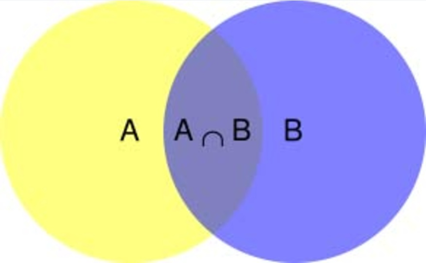
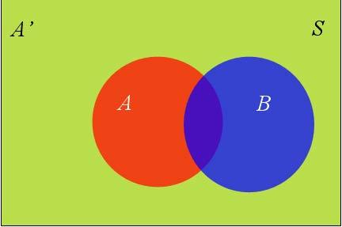
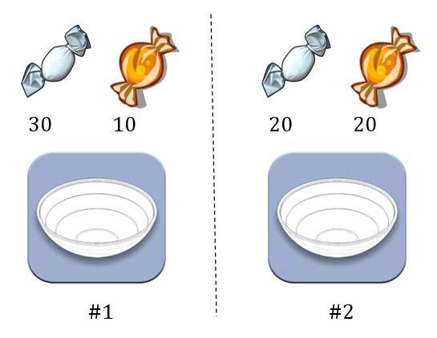
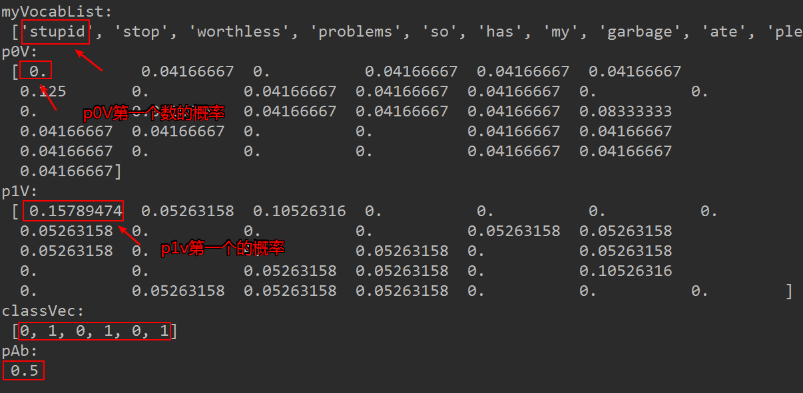
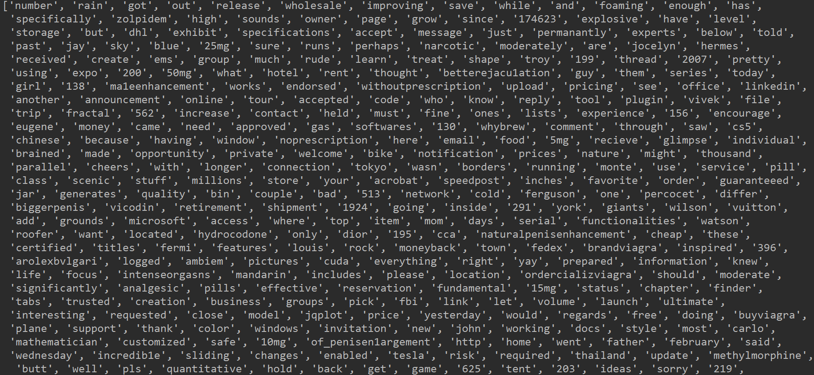
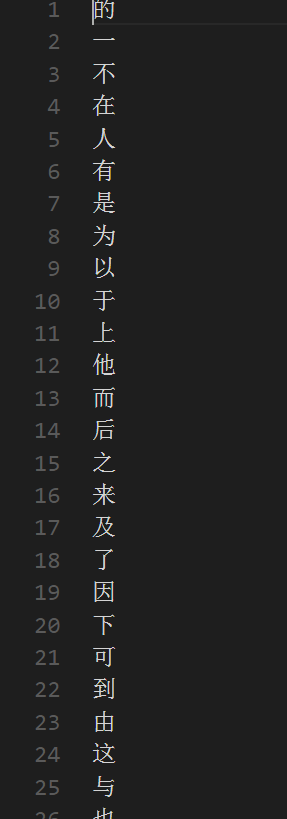

## 一、前言
---
朴素贝叶斯算法是有监督的学习算法，解决的是分类问题，如客户是否流失、是否值得投资、信用等级评定等多分类问题。该算法的优点在于简单易懂、学习效率高、在某些领域的分类问题中能够与决策树、神经网络相媲美。但由于该算法以自变量之间的独立（条件特征独立）性和连续变量的正态性假设为前提，就会导致算法精度在某种程度上受影响。

本篇文章将从朴素贝叶斯推断原理开始讲起，通过实例进行辅助讲解。最后，使用Python3编程实现一个简单的言论过滤器，新浪微博分类，垃圾邮件分类等等

本文出现的所有代码，均可在我的github上下载，欢迎Follow、Star：[Github地址](https://github.com/yaoguangju/machine_learning)

## 二、朴素贝叶斯理论
---
朴素贝叶斯是贝叶斯决策理论的一部分，所以在讲述朴素贝叶斯之前有必要快速了解一下贝叶斯决策理论。

#### 1、贝叶斯决策理论
假设现在我们有一个数据集，它由两类数据组成，数据分布如下图所示：


我们现在用p1(x,y)表示数据点(x,y)属于类别1(图中红色圆点表示的类别)的概率，用p2(x,y)表示数据点(x,y)属于类别2(图中蓝色三角形表示的类别)的概率，那么对于一个新数据点(x,y)，可以用下面的规则来判断它的类别：

- 如果p1(x,y)> p2(x,y)，那么类别为1
- 如果p1(x,y)< p2(x,y)，那么类别为2

也就是说，我们会选择高概率对应的类别。这就是贝叶斯决策理论的核心思想，即选择具有最高概率的决策。已经了解了贝叶斯决策理论的核心思想，那么接下来，就是学习如何计算p1和p2概率。

#### 2、条件概率
在学习计算p1 和p2概率之前，我们需要了解什么是条件概率(Condittional probability)，就是指在事件B发生的情况下，事件A发生的概率，用P(A|B)来表示。



根据文氏图，可以很清楚地看到在事件B发生的情况下，事件A发生的概率就是P(A∩B)除以P(B)。


因此，


同理可得，


所以，


即


这就是条件概率的计算公式。

#### 3、全概率公式
除了条件概率以外，在计算p1和p2的时候，还要用到全概率公式，因此，这里继续推导全概率公式。

假定样本空间S，是两个事件A与A'的和。


上图中，红色部分是事件A，绿色部分是事件A'，它们共同构成了样本空间S。

在这种情况下，事件B可以划分成两个部分。



即


在上一节的推导当中，我们已知


所以，


这就是全概率公式。它的含义是，如果A和A'构成样本空间的一个划分，那么事件B的概率，就等于A和A'的概率分别乘以B对这两个事件的条件概率之和。

将这个公式代入上一节的条件概率公式，就得到了条件概率的另一种写法：


#### 4、贝叶斯推断
对条件概率公式进行变形，可以得到如下形式：


我们把P(A)称为"先验概率"（Prior probability），即在B事件发生之前，我们对A事件概率的一个判断。

P(A|B)称为"后验概率"（Posterior probability），即在B事件发生之后，我们对A事件概率的重新评估。

P(B|A)/P(B)称为"可能性函数"（Likelyhood），这是一个调整因子，使得预估概率更接近真实概率。

所以，条件概率可以理解成下面的式子：


<center>**后验概率　＝　先验概率 ｘ 调整因子**</center>

这就是贝叶斯推断的含义。我们先预估一个"先验概率"，然后加入实验结果，看这个实验到底是增强还是削弱了"先验概率"，由此得到更接近事实的"后验概率"。

在这里，如果"可能性函数"P(B|A)/P(B)>1，意味着"先验概率"被增强，事件A的发生的可能性变大；如果"可能性函数"=1，意味着B事件无助于判断事件A的可能性；如果"可能性函数"<1，意味着"先验概率"被削弱，事件A的可能性变小。

为了加深对贝叶斯推断的理解，我们举一个例子。



两个一模一样的碗，一号碗有30颗水果糖和10颗巧克力糖，二号碗有水果糖和巧克力糖各20颗。现在随机选择一个碗，从中摸出一颗糖，发现是水果糖。请问这颗水果糖来自一号碗的概率有多大？

我们假定，H1表示一号碗，H2表示二号碗。由于这两个碗是一样的，所以P(H1)=P(H2)，也就是说，在取出水果糖之前，这两个碗被选中的概率相同。因此，P(H1)=0.5，我们把这个概率就叫做"先验概率"，即没有做实验之前，来自一号碗的概率是0.5。

再假定，E表示水果糖，所以问题就变成了在已知E的情况下，来自一号碗的概率有多大，即求P(H1|E)。我们把这个概率叫做"后验概率"，即在E事件发生之后，对P(H1)的修正。

根据条件概率公式，得到


已知，P(H1)等于0.5，P(E|H1)为一号碗中取出水果糖的概率，等于30÷(30+10)=0.75，那么求出P(E)就可以得到答案。根据全概率公式，


所以，


将数字代入原方程，得到


这表明，来自一号碗的概率是0.6。也就是说，取出水果糖之后，H1事件的可能性得到了增强。

同时再思考一个问题，在使用该算法的时候，如果不需要知道具体的类别概率，即上面P(H1|E)=0.6，只需要知道所属类别，即来自一号碗，我们有必要计算P(E)这个全概率吗？要知道我们只需要比较 P(H1|E)和P(H2|E)的大小，找到那个最大的概率就可以。既然如此，两者的分母都是相同的，那我们只需要比较分子即可。即比较P(E|H1)P(H1)和P(E|H2)P(H2)的大小，所以为了减少计算量，全概率公式在实际编程中可以不使用。

#### 5、朴素贝叶斯推断

理解了贝叶斯推断，那么让我们继续看看朴素贝叶斯。贝叶斯和朴素贝叶斯的概念是不同的，区别就在于“朴素”二字，朴素贝叶斯对条件个概率分布做了条件独立性的假设。 比如下面的公式，假设有n个特征：


由于每个特征都是独立的，我们可以进一步拆分公式 ：


这样我们就可以进行计算了。如果有些迷糊，让我们从一个例子开始讲起，你会看到贝叶斯分类器很好懂，一点都不难。

某个医院早上来了六个门诊的病人，他们的情况如下表所示：


现在又来了第七个病人，是一个打喷嚏的建筑工人。请问他患上感冒的概率有多大？

根据贝叶斯定理：


可得：


根据朴素贝叶斯条件独立性的假设可知，"打喷嚏"和"建筑工人"这两个特征是独立的，因此，上面的等式就变成了


这里可以计算：


因此，这个打喷嚏的建筑工人，有66%的概率是得了感冒。同理，可以计算这个病人患上过敏或脑震荡的概率。比较这几个概率，就可以知道他最可能得什么病。

这就是贝叶斯分类器的基本方法：在统计资料的基础上，依据某些特征，计算各个类别的概率，从而实现分类。

同样，在编程的时候，如果不需要求出所属类别的具体概率，P(打喷嚏) = 0.5和P(建筑工人) = 0.33的概率是可以不用求的。

## 三、实战项目：简单言论过滤器
---
以在线社区留言为例。为了不影响社区的发展，我们要屏蔽侮辱性的言论，所以要构建一个快速过滤器，如果某条留言使用了负面或者侮辱性的语言，那么就将该留言标志为内容不当。过滤这类内容是一个很常见的需求。对此问题建立两个类型：侮辱类和非侮辱类，使用1和0分别表示。

我们把文本看成单词向量或者词条向量，也就是说将句子转换为向量。考虑出现所有文档中的单词，再决定将哪些单词纳入词汇表或者说所要的词汇集合，然后必须要将每一篇文档转换为词汇表上的向量。简单起见，我们先假设已经将本文切分完毕，存放到列表中，并对词汇向量进行分类标注。编写代码如下：

```python
# -*- coding: UTF-8 -*-
"""
函数说明:创建实验样本

Parameters:
    无
Returns:
    postingList - 实验样本切分的词条
    classVec - 类别标签向量

"""

def loadDataSet():
	postingList = [['my', 'dog', 'has', 'flea', 'problems', 'help', 'please'],  # 切分的词条
				   ['maybe', 'not', 'take', 'him', 'to', 'dog', 'park', 'stupid'],
				   ['my', 'dalmation', 'is', 'so', 'cute', 'I', 'love', 'him'],
				   ['stop', 'posting', 'stupid', 'worthless', 'garbage'],
				   ['mr', 'licks', 'ate', 'my', 'steak', 'how', 'to', 'stop', 'him'],
				   ['quit', 'buying', 'worthless', 'dog', 'food', 'stupid']]
	classVec = [0, 1, 0, 1, 0, 1]  # 类别标签向量，1代表侮辱性词汇，0代表不是
	return postingList, classVec


if __name__ == '__main__':
	postingLIst, classVec = loadDataSet()
	for each in postingLIst:
		print(each)
	print(classVec)
```
从运行结果可以看出，我们已经将postingList是存放词条列表中，classVec是存放每个词条的所属类别，1代表侮辱类 ，0代表非侮辱类。


继续编写代码，前面我们已经说过我们要先创建一个词汇表，并将切分好的词条转换为词条向量。

```python
# -*- coding: UTF-8 -*-

"""
函数说明:创建实验样本

Parameters:
    无
Returns:
    postingList - 实验样本切分的词条
    classVec - 类别标签向量

"""
def loadDataSet():
    postingList=[['my', 'dog', 'has', 'flea', 'problems', 'help', 'please'],                #切分的词条
                 ['maybe', 'not', 'take', 'him', 'to', 'dog', 'park', 'stupid'],
                 ['my', 'dalmation', 'is', 'so', 'cute', 'I', 'love', 'him'],
                 ['stop', 'posting', 'stupid', 'worthless', 'garbage'],
                 ['mr', 'licks', 'ate', 'my', 'steak', 'how', 'to', 'stop', 'him'],
                 ['quit', 'buying', 'worthless', 'dog', 'food', 'stupid']]
    classVec = [0,1,0,1,0,1]                                                                   #类别标签向量，1代表侮辱性词汇，0代表不是
    return postingList,classVec

"""
函数说明:根据vocabList词汇表，将inputSet向量化，向量的每个元素为1或0

Parameters:
    vocabList - createVocabList返回的列表
    inputSet - 切分的词条列表
Returns:
    returnVec - 文档向量,词集模型

"""
def setOfWords2Vec(vocabList, inputSet):
    returnVec = [0] * len(vocabList)                                    #创建一个其中所含元素都为0的向量
    for word in inputSet:                                                #遍历每个词条
        if word in vocabList:                                            #如果词条存在于词汇表中，则置1
            returnVec[vocabList.index(word)] = 1
        else: print("the word: %s is not in my Vocabulary!" % word)
    return returnVec                                                    #返回文档向量

"""
函数说明:将切分的实验样本词条整理成不重复的词条列表，也就是词汇表

Parameters:
    dataSet - 整理的样本数据集
Returns:
    vocabSet - 返回不重复的词条列表，也就是词汇表

"""
def createVocabList(dataSet):
    vocabSet = set([])                      #创建一个空的不重复列表
    for document in dataSet:
        vocabSet = vocabSet | set(document) #取并集
    return list(vocabSet)

if __name__ == '__main__':
    postingList, classVec = loadDataSet()
    print('postingList:\n',postingList)
    myVocabList = createVocabList(postingList)
    print('myVocabList:\n',myVocabList)
    trainMat = []
    for postinDoc in postingList:
        trainMat.append(setOfWords2Vec(myVocabList, postinDoc))
    print('trainMat:\n', trainMat)
```

从运行结果可以看出，postingList是原始的词条列表，myVocabList是词汇表。myVocabList是所有单词出现的集合，没有重复的元素。词汇表是用来干什么的？没错，它是用来将词条向量化的，一个单词在词汇表中出现过一次，那么就在相应位置记作1，如果没有出现就在相应位置记作0。trainMat是所有的词条向量组成的列表。它里面存放的是根据myVocabList向量化的词条向量。


我们已经得到了词条向量。接下来，我们就可以通过词条向量训练朴素贝叶斯分类器。

```python
import numpy as np

"""
函数说明:创建实验样本

Parameters:
    无
Returns:
    postingList - 实验样本切分的词条
    classVec - 类别标签向量

"""
def loadDataSet():
    postingList=[['my', 'dog', 'has', 'flea', 'problems', 'help', 'please'],                #切分的词条
                 ['maybe', 'not', 'take', 'him', 'to', 'dog', 'park', 'stupid'],
                 ['my', 'dalmation', 'is', 'so', 'cute', 'I', 'love', 'him'],
                 ['stop', 'posting', 'stupid', 'worthless', 'garbage'],
                 ['mr', 'licks', 'ate', 'my', 'steak', 'how', 'to', 'stop', 'him'],
                 ['quit', 'buying', 'worthless', 'dog', 'food', 'stupid']]
    classVec = [0,1,0,1,0,1]                                                                   #类别标签向量，1代表侮辱性词汇，0代表不是
    return postingList,classVec

"""
函数说明:根据vocabList词汇表，将inputSet向量化，向量的每个元素为1或0

Parameters:
    vocabList - createVocabList返回的列表
    inputSet - 切分的词条列表
Returns:
    returnVec - 文档向量,词集模型
    
"""
def setOfWords2Vec(vocabList, inputSet):
    returnVec = [0] * len(vocabList)                                    #创建一个其中所含元素都为0的向量
    for word in inputSet:                                                #遍历每个词条
        if word in vocabList:                                            #如果词条存在于词汇表中，则置1
            returnVec[vocabList.index(word)] = 1
        else: print("the word: %s is not in my Vocabulary!" % word)
    return returnVec                                                    #返回文档向量

"""
函数说明:将切分的实验样本词条整理成不重复的词条列表，也就是词汇表

Parameters:
    dataSet - 整理的样本数据集
Returns:
    vocabSet - 返回不重复的词条列表，也就是词汇表

"""
def createVocabList(dataSet):
    vocabSet = set([])                      #创建一个空的不重复列表
    for document in dataSet:
        vocabSet = vocabSet | set(document) #取并集
    return list(vocabSet)

"""
函数说明:朴素贝叶斯分类器训练函数

Parameters:
    trainMatrix - 训练文档矩阵，即setOfWords2Vec返回的returnVec构成的矩阵
    trainCategory - 训练类别标签向量，即loadDataSet返回的classVec
Returns:
    p0Vect - 非侮辱类的条件概率数组
    p1Vect - 侮辱类的条件概率数组
    pAbusive - 文档属于侮辱类的概率

"""
def trainNB0(trainMatrix,trainCategory):
    numTrainDocs = len(trainMatrix)                            #计算训练的文档数目
    numWords = len(trainMatrix[0])                            #计算每篇文档的词条数
    pAbusive = sum(trainCategory)/float(numTrainDocs)        #文档属于侮辱类的概率
    p0Num = np.zeros(numWords); p1Num = np.zeros(numWords)    #创建numpy.zeros数组,词条出现数初始化为0
    p0Denom = 0.0; p1Denom = 0.0                            #分母初始化为0
    for i in range(numTrainDocs):
        if trainCategory[i] == 1:                            #统计属于侮辱类的条件概率所需的数据，即P(w0|1),P(w1|1),P(w2|1)···
            p1Num += trainMatrix[i]
            p1Denom += sum(trainMatrix[i])
        else:                                                #统计属于非侮辱类的条件概率所需的数据，即P(w0|0),P(w1|0),P(w2|0)···
            p0Num += trainMatrix[i]
            p0Denom += sum(trainMatrix[i])
    p1Vect = p1Num/p1Denom
    p0Vect = p0Num/p0Denom
    return p0Vect,p1Vect,pAbusive                            #返回属于侮辱类的条件概率数组，属于非侮辱类的条件概率数组，文档属于侮辱类的概率

if __name__ == '__main__':
    postingList, classVec = loadDataSet()
    myVocabList = createVocabList(postingList)
    print('myVocabList:\n', myVocabList)
    trainMat = []
    for postinDoc in postingList:
        trainMat.append(setOfWords2Vec(myVocabList, postinDoc))
    p0V, p1V, pAb = trainNB0(trainMat, classVec)
    print('p0V:\n', p0V)
    print('p1V:\n', p1V)
    print('classVec:\n', classVec)
    print('pAb:\n', pAb)
```
运行结果如下，p0V存放的是每个单词属于类别0，也就是非侮辱类词汇的概率。比如p0V的倒数第6个概率，就是stupid这个单词属于非侮辱类的概率为0。同理，p1V的倒数第6个概率，就是stupid这个单词属于侮辱类的概率为0.15789474，也就是约等于15.79%的概率。我们知道stupid的中文意思是蠢货，难听点的叫法就是傻逼。显而易见，这个单词属于侮辱类。pAb是所有侮辱类的样本占所有样本的概率，从classVec中可以看出，一用有3个侮辱类，3个非侮辱类。所以侮辱类的概率是0.5。因此p0V存放的就是P(him|非侮辱类) = 0.0833、P(is|非侮辱类) = 0.0417，一直到P(dog|非侮辱类) = 0.0417，这些单词的条件概率。同理，p1V存放的就是各个单词属于侮辱类的条件概率。pAb就是先验概率。



已经训练好分类器，接下来，使用分类器进行分类。

```python
# -*- coding: UTF-8 -*-
import numpy as np
from functools import reduce

"""
函数说明:创建实验样本

Parameters:
	无
Returns:
	postingList - 实验样本切分的词条
	classVec - 类别标签向量

"""
def loadDataSet():
	postingList=[['my', 'dog', 'has', 'flea', 'problems', 'help', 'please'],				#切分的词条
				['maybe', 'not', 'take', 'him', 'to', 'dog', 'park', 'stupid'],
				['my', 'dalmation', 'is', 'so', 'cute', 'I', 'love', 'him'],
				['stop', 'posting', 'stupid', 'worthless', 'garbage'],
				['mr', 'licks', 'ate', 'my', 'steak', 'how', 'to', 'stop', 'him'],
				['quit', 'buying', 'worthless', 'dog', 'food', 'stupid']]
	classVec = [0,1,0,1,0,1]   																#类别标签向量，1代表侮辱性词汇，0代表不是
	return postingList,classVec																#返回实验样本切分的词条和类别标签向量

"""
函数说明:将切分的实验样本词条整理成不重复的词条列表，也就是词汇表

Parameters:
	dataSet - 整理的样本数据集
Returns:
	vocabSet - 返回不重复的词条列表，也就是词汇表

"""
def createVocabList(dataSet):
	vocabSet = set([])  					#创建一个空的不重复列表
	for document in dataSet:
		vocabSet = vocabSet | set(document) #取并集
	return list(vocabSet)

"""
函数说明:根据vocabList词汇表，将inputSet向量化，向量的每个元素为1或0

Parameters:
	vocabList - createVocabList返回的列表
	inputSet - 切分的词条列表
Returns:
	returnVec - 文档向量,词集模型

"""
def setOfWords2Vec(vocabList, inputSet):
	returnVec = [0] * len(vocabList)									#创建一个其中所含元素都为0的向量
	for word in inputSet:												#遍历每个词条
		if word in vocabList:											#如果词条存在于词汇表中，则置1
			returnVec[vocabList.index(word)] = 1
		else: print("the word: %s is not in my Vocabulary!" % word)
	return returnVec													#返回文档向量


"""
函数说明:朴素贝叶斯分类器训练函数

Parameters:
	trainMatrix - 训练文档矩阵，即setOfWords2Vec返回的returnVec构成的矩阵
	trainCategory - 训练类别标签向量，即loadDataSet返回的classVec
Returns:
	p0Vect - 非侮辱类的条件概率数组
	p1Vect - 侮辱类的条件概率数组
	pAbusive - 文档属于侮辱类的概率

"""
def trainNB0(trainMatrix,trainCategory):
	numTrainDocs = len(trainMatrix)							#计算训练的文档数目
	numWords = len(trainMatrix[0])							#计算每篇文档的词条数
	pAbusive = sum(trainCategory)/float(numTrainDocs)		#文档属于侮辱类的概率
	p0Num = np.zeros(numWords); p1Num = np.zeros(numWords)	#创建numpy.zeros数组,
	p0Denom = 0.0; p1Denom = 0.0                        	#分母初始化为0.0
	for i in range(numTrainDocs):
		if trainCategory[i] == 1:							#统计属于侮辱类的条件概率所需的数据，即P(w0|1),P(w1|1),P(w2|1)···
			p1Num += trainMatrix[i]
			p1Denom += sum(trainMatrix[i])
		else:												#统计属于非侮辱类的条件概率所需的数据，即P(w0|0),P(w1|0),P(w2|0)···
			p0Num += trainMatrix[i]
			p0Denom += sum(trainMatrix[i])
	p1Vect = p1Num/p1Denom									#相除
	p0Vect = p0Num/p0Denom
	return p0Vect,p1Vect,pAbusive							#返回属于侮辱类的条件概率数组，属于非侮辱类的条件概率数组，文档属于侮辱类的概率

"""
函数说明:朴素贝叶斯分类器分类函数

Parameters:
	vec2Classify - 待分类的词条数组
	p0Vec - 侮辱类的条件概率数组
	p1Vec -非侮辱类的条件概率数组
	pClass1 - 文档属于侮辱类的概率
Returns:
	0 - 属于非侮辱类
	1 - 属于侮辱类

"""
def classifyNB(vec2Classify, p0Vec, p1Vec, pClass1):
	p1 = reduce(lambda x,y:x*y, vec2Classify * p1Vec) * pClass1    			#对应元素相乘
	p0 = reduce(lambda x,y:x*y, vec2Classify * p0Vec) * (1.0 - pClass1)
	print('p0:',p0)
	print('p1:',p1)
	if p1 > p0:
		return 1
	else:
		return 0

"""
函数说明:测试朴素贝叶斯分类器

Parameters:
	无
Returns:
	无

"""
def testingNB():
	listOPosts,listClasses = loadDataSet()									#创建实验样本
	myVocabList = createVocabList(listOPosts)								#创建词汇表
	trainMat=[]
	for postinDoc in listOPosts:
		trainMat.append(setOfWords2Vec(myVocabList, postinDoc))				#将实验样本向量化
	p0V,p1V,pAb = trainNB0(np.array(trainMat),np.array(listClasses))		#训练朴素贝叶斯分类器
	testEntry = ['love', 'my', 'dalmation']									#测试样本1
	thisDoc = np.array(setOfWords2Vec(myVocabList, testEntry))				#测试样本向量化
	if classifyNB(thisDoc,p0V,p1V,pAb):
		print(testEntry,'属于侮辱类')										#执行分类并打印分类结果
	else:
		print(testEntry,'属于非侮辱类')										#执行分类并打印分类结果
	testEntry = ['stupid', 'garbage']										#测试样本2

	thisDoc = np.array(setOfWords2Vec(myVocabList, testEntry))				#测试样本向量化
	if classifyNB(thisDoc,p0V,p1V,pAb):
		print(testEntry,'属于侮辱类')										#执行分类并打印分类结果
	else:
		print(testEntry,'属于非侮辱类')										#执行分类并打印分类结果

if __name__ == '__main__':
	testingNB()
```

我们测试了两个词条，在使用分类器前，也需要对词条向量化，然后使用classifyNB()函数，用朴素贝叶斯公式，计算词条向量属于侮辱类和非侮辱类的概率。运行结果如下：


从上图可以看出，在计算的时候已经出现了概率为0的情况。如果新实例文本，包含这种概率为0的分词，那么最终的文本属于某个类别的概率也就是0了。显然，这样是不合理的，为了降低这种影响，可以将所有词的出现数初始化为1，并将分母初始化为2。这种做法就叫做拉普拉斯平滑(Laplace Smoothing)又被称为加1平滑，是比较常用的平滑方法，它就是为了解决0概率问题。

除此之外，另外一个遇到的问题就是下溢出，这是由于太多很小的数相乘造成的。学过数学的人都知道，两个小数相乘，越乘越小，这样就造成了下溢出。在程序中，在相应小数位置进行四舍五入，计算结果可能就变成0了。为了解决这个问题，对乘积结果取自然对数。通过求对数可以避免下溢出或者浮点数舍入导致的错误。同时，采用自然对数进行处理不会有任何损失。下图给出函数f(x)和ln(f(x))的曲线。


检查这两条曲线，就会发现它们在相同区域内同时增加或者减少，并且在相同点上取到极值。它们的取值虽然不同，但不影响最终结果。因此我们可以对上文的trainNB0(trainMatrix, trainCategory)函数进行更改，修改如下：

```python
"""
函数说明:朴素贝叶斯分类器训练函数

Parameters:
    trainMatrix - 训练文档矩阵，即setOfWords2Vec返回的returnVec构成的矩阵
    trainCategory - 训练类别标签向量，即loadDataSet返回的classVec
Returns:
    p0Vect - 非侮辱类的条件概率数组
    p1Vect - 侮辱类的条件概率数组
    pAbusive - 文档属于侮辱类的概率

"""
def trainNB0(trainMatrix,trainCategory):
    numTrainDocs = len(trainMatrix)                            #计算训练的文档数目
    numWords = len(trainMatrix[0])                            #计算每篇文档的词条数
    pAbusive = sum(trainCategory)/float(numTrainDocs)        #文档属于侮辱类的概率
    p0Num = np.ones(numWords); p1Num = np.ones(numWords)    #创建numpy.ones数组,词条出现数初始化为1，拉普拉斯平滑
    p0Denom = 2.0; p1Denom = 2.0                            #分母初始化为2,拉普拉斯平滑
    for i in range(numTrainDocs):
        if trainCategory[i] == 1:                            #统计属于侮辱类的条件概率所需的数据，即P(w0|1),P(w1|1),P(w2|1)···
            p1Num += trainMatrix[i]
            p1Denom += sum(trainMatrix[i])
        else:                                                #统计属于非侮辱类的条件概率所需的数据，即P(w0|0),P(w1|0),P(w2|0)···
            p0Num += trainMatrix[i]
            p0Denom += sum(trainMatrix[i])
    p1Vect = np.log(p1Num/p1Denom)                            #取对数，防止下溢出         
    p0Vect = np.log(p0Num/p0Denom)         
    return p0Vect,p1Vect,pAbusive                            #返回属于侮辱类的条件概率数组，属于非侮辱类的条件概率数组，文档属于侮辱类的概率
```


运行代码，就可以得到如下结果：


这样我们得到的结果就没有问题了，不存在0概率。当然除此之外，我们还需要对代码进行修改classifyNB(vec2Classify, p0Vec, p1Vec, pClass1)函数，修改如下：
```python
"""
函数说明:朴素贝叶斯分类器分类函数

Parameters:
    vec2Classify - 待分类的词条数组
    p0Vec - 非侮辱类的条件概率数组
    p1Vec -侮辱类的条件概率数组
    pClass1 - 文档属于侮辱类的概率
Returns:
    0 - 属于非侮辱类
    1 - 属于侮辱类

"""
def classifyNB(vec2Classify, p0Vec, p1Vec, pClass1):
    p1 = sum(vec2Classify * p1Vec) + np.log(pClass1)        #对应元素相乘。logA * B = logA + logB，所以这里加上log(pClass1)
    p0 = sum(vec2Classify * p0Vec) + np.log(1.0 - pClass1)
    if p1 > p0:
        return 1
    else:
        return 0
```

为啥这么改？因为取自然对数了。logab = loga + logb。

朴素贝叶斯分类器就改进完毕了。

## 四、朴素贝叶斯之过滤垃圾邮件
---

在上文那个简单的例子中，我们引入了字符串列表。使用朴素贝叶斯解决一些现实生活中的问题时，需要先从文本内容得到字符串列表，然后生成词向量。下面这个例子中，我们将了解朴素贝叶斯的一个最著名的应用：电子邮件垃圾过滤。首先看一下使用朴素贝叶斯对电子邮件进行分类的步骤：

- 收集数据：提供文本文件。
- 准备数据：将文本文件解析成词条向量。
- 分析数据：检查词条确保解析的正确性。
- 训练算法：使用我们之前建立的trainNB0()函数。
- 测试算法：使用classifyNB()，并构建一个新的测试函数来计算文档集的错误率。
- 使用算法：构建一个完整的程序对一组文档进行分类，将错分的文档输出到屏幕上。

#### 1、收集数据
数据我已经为大家准备好了，可以在我的Github上下载： **数据集下载**

有两个文件夹ham和spam，spam文件下的txt文件为垃圾邮件。

#### 2、准备数据
对于英文文本，我们可以以非字母、非数字作为符号进行切分，使用split函数即可。编写代码如下：


这样我们就得到了词汇表，结果如下图所示：



根据词汇表，我们就可以将每个文本向量化。我们将数据集分为训练集和测试集，使用交叉验证的方式测试朴素贝叶斯分类器的准确性。编写代码如下：
```python
# -*- coding: UTF-8 -*-
import numpy as np
import random
import re


"""
函数说明:将切分的实验样本词条整理成不重复的词条列表，也就是词汇表
Parameters:
	dataSet - 整理的样本数据集
Returns:
	vocabSet - 返回不重复的词条列表，也就是词汇表

"""
def createVocabList(dataSet):
    vocabSet = set([])  					#创建一个空的不重复列表
    for document in dataSet:
        vocabSet = vocabSet | set(document) #取并集
    return list(vocabSet)

"""
函数说明:根据vocabList词汇表，将inputSet向量化，向量的每个元素为1或0
Parameters:
	vocabList - createVocabList返回的列表
	inputSet - 切分的词条列表
Returns:
	returnVec - 文档向量,词集模型

"""
def setOfWords2Vec(vocabList, inputSet):
    returnVec = [0] * len(vocabList)									#创建一个其中所含元素都为0的向量
    for word in inputSet:												#遍历每个词条
        if word in vocabList:											#如果词条存在于词汇表中，则置1
            returnVec[vocabList.index(word)] = 1
        else: print("the word: %s is not in my Vocabulary!" % word)
    return returnVec													#返回文档向量


"""
函数说明:根据vocabList词汇表，构建词袋模型
Parameters:
	vocabList - createVocabList返回的列表
	inputSet - 切分的词条列表
Returns:
	returnVec - 文档向量,词袋模型

"""
def bagOfWords2VecMN(vocabList, inputSet):
    returnVec = [0]*len(vocabList)										#创建一个其中所含元素都为0的向量
    for word in inputSet:												#遍历每个词条
        if word in vocabList:											#如果词条存在于词汇表中，则计数加一
            returnVec[vocabList.index(word)] += 1
    return returnVec													#返回词袋模型

"""
函数说明:朴素贝叶斯分类器训练函数
Parameters:
	trainMatrix - 训练文档矩阵，即setOfWords2Vec返回的returnVec构成的矩阵
	trainCategory - 训练类别标签向量，即loadDataSet返回的classVec
Returns:
	p0Vect - 非侮辱类的条件概率数组
	p1Vect - 侮辱类的条件概率数组
	pAbusive - 文档属于侮辱类的概率

"""
def trainNB0(trainMatrix,trainCategory):
    numTrainDocs = len(trainMatrix)							#计算训练的文档数目
    numWords = len(trainMatrix[0])							#计算每篇文档的词条数
    pAbusive = sum(trainCategory)/float(numTrainDocs)		#文档属于侮辱类的概率
    p0Num = np.ones(numWords); p1Num = np.ones(numWords)	#创建numpy.ones数组,词条出现数初始化为1，拉普拉斯平滑
    p0Denom = 2.0; p1Denom = 2.0                        	#分母初始化为2,拉普拉斯平滑
    for i in range(numTrainDocs):
        if trainCategory[i] == 1:							#统计属于侮辱类的条件概率所需的数据，即P(w0|1),P(w1|1),P(w2|1)···
            p1Num += trainMatrix[i]
            p1Denom += sum(trainMatrix[i])
        else:												#统计属于非侮辱类的条件概率所需的数据，即P(w0|0),P(w1|0),P(w2|0)···
            p0Num += trainMatrix[i]
            p0Denom += sum(trainMatrix[i])
    p1Vect = np.log(p1Num/p1Denom)							#取对数，防止下溢出
    p0Vect = np.log(p0Num/p0Denom)
    return p0Vect,p1Vect,pAbusive							#返回属于侮辱类的条件概率数组，属于非侮辱类的条件概率数组，文档属于侮辱类的概率

"""
函数说明:朴素贝叶斯分类器分类函数
Parameters:
	vec2Classify - 待分类的词条数组
	p0Vec - 非侮辱类的条件概率数组
	p1Vec -侮辱类的条件概率数组
	pClass1 - 文档属于侮辱类的概率
Returns:
	0 - 属于非侮辱类
	1 - 属于侮辱类

"""
def classifyNB(vec2Classify, p0Vec, p1Vec, pClass1):
    p1 = sum(vec2Classify * p1Vec) + np.log(pClass1)    	#对应元素相乘。logA * B = logA + logB，所以这里加上log(pClass1)
    p0 = sum(vec2Classify * p0Vec) + np.log(1.0 - pClass1)
    if p1 > p0:
        return 1
    else:
        return 0

"""
函数说明:接收一个大字符串并将其解析为字符串列表
Parameters:
    无
Returns:
    无

"""
def textParse(bigString):                                                   #将字符串转换为字符列表
    listOfTokens = re.split(r'[\W*]', bigString)                              #将特殊符号作为切分标志进行字符串切分，即非字母、非数字
    return [tok.lower() for tok in listOfTokens if len(tok) > 2]            #除了单个字母，例如大写的I，其它单词变成小写

"""
函数说明:测试朴素贝叶斯分类器
Parameters:
    无
Returns:
    无

"""
def spamTest():
    docList = []; classList = []; fullText = []
    for i in range(1, 26):                                                  #遍历25个txt文件
        wordList = textParse(open('email/spam/%d.txt' % i, 'r').read())     #读取每个垃圾邮件，并字符串转换成字符串列表
        docList.append(wordList)
        fullText.append(wordList)
        classList.append(1)                                                 #标记垃圾邮件，1表示垃圾文件
        wordList = textParse(open('email/ham/%d.txt' % i, 'r').read())      #读取每个非垃圾邮件，并字符串转换成字符串列表
        docList.append(wordList)
        fullText.append(wordList)
        classList.append(0)                                                 #标记非垃圾邮件，1表示垃圾文件
    vocabList = createVocabList(docList)                                    #创建词汇表，不重复
    trainingSet = list(range(50)); testSet = []                             #创建存储训练集的索引值的列表和测试集的索引值的列表
    for i in range(10):                                                     #从50个邮件中，随机挑选出40个作为训练集,10个做测试集
        randIndex = int(random.uniform(0, len(trainingSet)))                #随机选取索索引值
        testSet.append(trainingSet[randIndex])                              #添加测试集的索引值
        del(trainingSet[randIndex])                                         #在训练集列表中删除添加到测试集的索引值
    trainMat = []; trainClasses = []                                        #创建训练集矩阵和训练集类别标签系向量
    for docIndex in trainingSet:                                            #遍历训练集
        trainMat.append(setOfWords2Vec(vocabList, docList[docIndex]))       #将生成的词集模型添加到训练矩阵中
        trainClasses.append(classList[docIndex])                            #将类别添加到训练集类别标签系向量中
    p0V, p1V, pSpam = trainNB0(np.array(trainMat), np.array(trainClasses))  #训练朴素贝叶斯模型
    errorCount = 0                                                          #错误分类计数
    for docIndex in testSet:                                                #遍历测试集
        wordVector = setOfWords2Vec(vocabList, docList[docIndex])           #测试集的词集模型
        if classifyNB(np.array(wordVector), p0V, p1V, pSpam) != classList[docIndex]:    #如果分类错误
            errorCount += 1                                                 #错误计数加1
            print("分类错误的测试集：",docList[docIndex])
    print('错误率：%.2f%%' % (float(errorCount) / len(testSet) * 100))

if __name__ == '__main__':
    spamTest()
```

运行结果如下：


函数spamTest()会输出在10封随机选择的电子邮件上的分类错误概率。既然这些电子邮件是随机选择的，所以每次的输出结果可能有些差别。如果发现错误的话，函数会输出错误的文档的此表，这样就可以了解到底是哪篇文档发生了错误。如果想要更好地估计错误率，那么就应该将上述过程重复多次，比如说10次，然后求平均值。相比之下，将垃圾邮件误判为正常邮件要比将正常邮件归为垃圾邮件好。为了避免错误，有多种方式可以用来修正分类器，这些内容会在后续文章中进行讨论。
## 五、朴素贝叶斯之新浪新闻分类(Sklearn)

#### 1、中文语句切分

考虑一个问题，英文的语句可以通过非字母和非数字进行切分，但是汉语句子呢？就比如我打的这一堆字，该如何进行切分呢？我们自己写个规则？

幸运地是，这部分的工作不需要我们自己做了，可以直接使用第三方分词组件，即jieba。

jieba已经兼容Python2和Python3，使用如下指令直接安装即可：

 
Python中文分词组件使用简单：

- 民间教程：https://www.oschina.net/p/jieba
- 官方教程：https://github.com/fxsjy/jieba

新闻分类数据集我也已经准备好，可以到我的Github进行下载：[数据集下载](https://github.com/yaoguangju/machine_learning/blob/master/%E8%B4%9D%E5%8F%B6%E6%96%AF%E7%AE%97%E6%B3%95/3.%E6%9C%B4%E7%B4%A0%E8%B4%9D%E5%8F%B6%E6%96%AF%E4%B9%8B%E6%96%B0%E6%B5%AA%E6%96%B0%E9%97%BB%E5%88%86%E7%B1%BB/stopwords_cn.txt)

数据集已经做好分类，分文件夹保存，分类结果如下：


数据集已经准备好，接下来，让我们直接进入正题。切分中文语句，编写如下代码：
```python
# -*- coding: UTF-8 -*-
import os
import jieba

def TextProcessing(folder_path):
    folder_list = os.listdir(folder_path)                        #查看folder_path下的文件
    data_list = []                                                #训练集
    class_list = []

    #遍历每个子文件夹
    for folder in folder_list:
        new_folder_path = os.path.join(folder_path, folder)        #根据子文件夹，生成新的路径
        files = os.listdir(new_folder_path)                        #存放子文件夹下的txt文件的列表

        j = 1
        #遍历每个txt文件
        for file in files:
            if j > 100:                                            #每类txt样本数最多100个
                break
            with open(os.path.join(new_folder_path, file), 'r', encoding = 'utf-8') as f:    #打开txt文件
                raw = f.read()

            word_cut = jieba.cut(raw, cut_all = False)            #精简模式，返回一个可迭代的generator
            word_list = list(word_cut)                            #generator转换为list

            data_list.append(word_list)
            class_list.append(folder)
            j += 1
        print(data_list)
        print(class_list)
if __name__ == '__main__':
    #文本预处理
    folder_path = './SogouC/Sample'                #训练集存放地址
    TextProcessing(folder_path)
```

代码运行结果如下所示，可以看到，我们已经顺利将每个文本进行切分，并进行了类别标记。


#### 2、文本特征选择

我们将所有文本分成训练集和测试集，并对训练集中的所有单词进行词频统计，并按降序排序。也就是将出现次数多的词语在前，出现次数少的词语在后进行排序。编写代码如下：
```python
# -*- coding: UTF-8 -*-
import os
import random
import jieba

"""
函数说明:中文文本处理

Parameters:
    folder_path - 文本存放的路径
    test_size - 测试集占比，默认占所有数据集的百分之20
Returns:
    all_words_list - 按词频降序排序的训练集列表
    train_data_list - 训练集列表
    test_data_list - 测试集列表
    train_class_list - 训练集标签列表
    test_class_list - 测试集标签列表

"""
def TextProcessing(folder_path, test_size = 0.2):
    folder_list = os.listdir(folder_path)                        #查看folder_path下的文件
    data_list = []                                                #数据集数据
    class_list = []                                                #数据集类别

    #遍历每个子文件夹
    for folder in folder_list:
        new_folder_path = os.path.join(folder_path, folder)        #根据子文件夹，生成新的路径
        files = os.listdir(new_folder_path)                        #存放子文件夹下的txt文件的列表

        j = 1
        #遍历每个txt文件
        for file in files:
            if j > 100:                                            #每类txt样本数最多100个
                break
            with open(os.path.join(new_folder_path, file), 'r', encoding = 'utf-8') as f:    #打开txt文件
                raw = f.read()

            word_cut = jieba.cut(raw, cut_all = False)            #精简模式，返回一个可迭代的generator
            word_list = list(word_cut)                            #generator转换为list

            data_list.append(word_list)                            #添加数据集数据
            class_list.append(folder)                            #添加数据集类别
            j += 1

    data_class_list = list(zip(data_list, class_list))            #zip压缩合并，将数据与标签对应压缩
    random.shuffle(data_class_list)                                #将data_class_list乱序
    index = int(len(data_class_list) * test_size) + 1            #训练集和测试集切分的索引值
    train_list = data_class_list[index:]                        #训练集
    test_list = data_class_list[:index]                            #测试集
    train_data_list, train_class_list = zip(*train_list)        #训练集解压缩
    test_data_list, test_class_list = zip(*test_list)            #测试集解压缩

    all_words_dict = {}                                            #统计训练集词频
    for word_list in train_data_list:
        for word in word_list:
            if word in all_words_dict.keys():
                all_words_dict[word] += 1
            else:
                all_words_dict[word] = 1

    #根据键的值倒序排序
    all_words_tuple_list = sorted(all_words_dict.items(), key = lambda f:f[1], reverse = True)
    all_words_list, all_words_nums = zip(*all_words_tuple_list)    #解压缩
    all_words_list = list(all_words_list)                        #转换成列表
    return all_words_list, train_data_list, test_data_list, train_class_list, test_class_list

if __name__ == '__main__':
    #文本预处理
    folder_path = './SogouC/Sample'                #训练集存放地址
    all_words_list, train_data_list, test_data_list, train_class_list, test_class_list = TextProcessing(folder_path, test_size=0.2)
    print(all_words_list)
```
all_words_list就是将所有训练集的切分结果通过词频降序排列构成的单词合集。观察一下打印结果，不难发现，这里包含了很多标点符号，很显然，这些标点符号是不能作为新闻分类的特征的。总不能说，应为这个文章逗号多，所以它是xx类新闻吧？为了降低这些高频的符号对分类结果的影响，我们应该怎么做呢？答曰：抛弃他们！ 除了这些，还有"在"，"了"这样对新闻分类无关痛痒的词。并且还有一些数字，数字显然也不能作为分类新闻的特征。所以要消除它们对分类结果的影响，我们可以定制一个规则。


一个简单的规则可以这样制定：首先去掉高频词，至于去掉多少个高频词，我们可以通过观察去掉高频词个数和最终检测准确率的关系来确定。除此之外，去除数字，不把数字作为分类特征。同时，去除一些特定的词语，比如："的"，"一"，"在"，"不"，"当然","怎么"这类的对新闻分类无影响的介词、代词、连词。怎么去除这些词呢？可以使用已经整理好的stopwords_cn.txt文本。下载地址：点我下载

这个文件是这个样子的：



所以我们可以根据这个文档，将这些单词去除，不作为分类的特征。我们先去除前100个高频词汇，然后编写代码如下：

```python
# -*- coding: UTF-8 -*-
import os
import random
import jieba

"""
函数说明:中文文本处理

Parameters:
    folder_path - 文本存放的路径
    test_size - 测试集占比，默认占所有数据集的百分之20
Returns:
    all_words_list - 按词频降序排序的训练集列表
    train_data_list - 训练集列表
    test_data_list - 测试集列表
    train_class_list - 训练集标签列表
    test_class_list - 测试集标签列表

"""
def TextProcessing(folder_path, test_size = 0.2):
    folder_list = os.listdir(folder_path)                        #查看folder_path下的文件
    data_list = []                                                #数据集数据
    class_list = []                                                #数据集类别

    #遍历每个子文件夹
    for folder in folder_list:
        new_folder_path = os.path.join(folder_path, folder)        #根据子文件夹，生成新的路径
        files = os.listdir(new_folder_path)                        #存放子文件夹下的txt文件的列表

        j = 1
        #遍历每个txt文件
        for file in files:
            if j > 100:                                            #每类txt样本数最多100个
                break
            with open(os.path.join(new_folder_path, file), 'r', encoding = 'utf-8') as f:    #打开txt文件
                raw = f.read()

            word_cut = jieba.cut(raw, cut_all = False)            #精简模式，返回一个可迭代的generator
            word_list = list(word_cut)                            #generator转换为list

            data_list.append(word_list)                            #添加数据集数据
            class_list.append(folder)                            #添加数据集类别
            j += 1

    data_class_list = list(zip(data_list, class_list))            #zip压缩合并，将数据与标签对应压缩
    random.shuffle(data_class_list)                                #将data_class_list乱序
    index = int(len(data_class_list) * test_size) + 1            #训练集和测试集切分的索引值
    train_list = data_class_list[index:]                        #训练集
    test_list = data_class_list[:index]                            #测试集
    train_data_list, train_class_list = zip(*train_list)        #训练集解压缩
    test_data_list, test_class_list = zip(*test_list)            #测试集解压缩

    all_words_dict = {}                                            #统计训练集词频
    for word_list in train_data_list:
        for word in word_list:
            if word in all_words_dict.keys():
                all_words_dict[word] += 1
            else:
                all_words_dict[word] = 1

    #根据键的值倒序排序
    all_words_tuple_list = sorted(all_words_dict.items(), key = lambda f:f[1], reverse = True)
    all_words_list, all_words_nums = zip(*all_words_tuple_list)    #解压缩
    all_words_list = list(all_words_list)                        #转换成列表
    return all_words_list, train_data_list, test_data_list, train_class_list, test_class_list

"""
函数说明:读取文件里的内容，并去重

Parameters:
    words_file - 文件路径
Returns:
    words_set - 读取的内容的set集合

"""
def MakeWordsSet(words_file):
    words_set = set()                                            #创建set集合
    with open(words_file, 'r', encoding = 'utf-8') as f:        #打开文件
        for line in f.readlines():                                #一行一行读取
            word = line.strip()                                    #去回车
            if len(word) > 0:                                    #有文本，则添加到words_set中
                words_set.add(word)
    return words_set                                             #返回处理结果

"""
函数说明:文本特征选取

Parameters:
    all_words_list - 训练集所有文本列表
    deleteN - 删除词频最高的deleteN个词
    stopwords_set - 指定的结束语
Returns:
    feature_words - 特征集

"""
def words_dict(all_words_list, deleteN, stopwords_set = set()):
    feature_words = []                            #特征列表
    n = 1
    for t in range(deleteN, len(all_words_list), 1):
        if n > 1000:                            #feature_words的维度为1000
            break
        #如果这个词不是数字，并且不是指定的结束语，并且单词长度大于1小于5，那么这个词就可以作为特征词
        if not all_words_list[t].isdigit() and all_words_list[t] not in stopwords_set and 1 < len(all_words_list[t]) < 5:
            feature_words.append(all_words_list[t])
        n += 1
    return feature_words

if __name__ == '__main__':
    #文本预处理
    folder_path = './SogouC/Sample'                #训练集存放地址
    all_words_list, train_data_list, test_data_list, train_class_list, test_class_list = TextProcessing(folder_path, test_size=0.2)

    #生成stopwords_set
    stopwords_file = './stopwords_cn.txt'
    stopwords_set = MakeWordsSet(stopwords_file)

    feature_words = words_dict(all_words_list, 100, stopwords_set)
    print(feature_words)
```

运行结果如下：


可以看到，我们已经滤除了那些没有用的词组，这个feature_words就是我们最终选出的用于新闻分类的特征。随后，我们就可以根据feature_words，将文本向量化，然后用于训练朴素贝叶斯分类器。这个向量化的思想和第三章的思想一致，因此不再累述。

#### 3、使用Sklearn构建朴素贝叶斯分类器
数据已经处理好了，接下来就可以使用sklearn构建朴素贝叶斯分类器了。

官方英文文档地址：文档地址

朴素贝叶斯是一类比较简单的算法，scikit-learn中朴素贝叶斯类库的使用也比较简单。相对于决策树，KNN之类的算法，朴素贝叶斯需要关注的参数是比较少的，这样也比较容易掌握。在scikit-learn中，一共有3个朴素贝叶斯的分类算法类。分别是GaussianNB，MultinomialNB和BernoulliNB。其中GaussianNB就是先验为高斯分布的朴素贝叶斯，MultinomialNB就是先验为多项式分布的朴素贝叶斯，而BernoulliNB就是先验为伯努利分布的朴素贝叶斯。上篇文章讲解的先验概率模型就是先验概率为多项式分布的朴素贝叶斯。


对于新闻分类，属于多分类问题。我们可以使用MultinamialNB()完成我们的新闻分类问题。另外两个函数的使用暂且不再进行扩展，可以自行学习。MultinomialNB假设特征的先验概率为多项式分布，即如下式：


其中， P(Xj = Xjl | Y = Ck)是第k个类别的第j维特征的第l个取值条件概率。mk是训练集中输出为第k类的样本个数。λ为一个大于0的常数，尝尝取值为1，即拉普拉斯平滑，也可以取其他值。

接下来，我们看下MultinamialNB这个函数，只有3个参数：


参数说明如下：

- alpha：浮点型可选参数，默认为1.0，其实就是添加拉普拉斯平滑，即为上述公式中的λ ，如果这个参数设置为0，就是不添加平滑；
- fit_prior：布尔型可选参数，默认为True。布尔参数fit_prior表示是否要考虑先验概率，如果是false,则所有的样本类别输出都有相同的类别先验概率。否则可以自己用第三个参数class_prior输入先验概率，或者不输入第三个参数class_prior让MultinomialNB自己从训练集样本来计算先验概率，此时的先验概率为P(Y=Ck)=mk/m。其中m为训练集样本总数量，mk为输出为第k类别的训练集样本数。
- class_prior：可选参数，默认为None。
总结如下：


除此之外，MultinamialNB也有一些方法供我们使用：


MultinomialNB一个重要的功能是有partial_fit方法，这个方法的一般用在如果训练集数据量非常大，一次不能全部载入内存的时候。这时我们可以把训练集分成若干等分，重复调用partial_fit来一步步的学习训练集，非常方便。GaussianNB和BernoulliNB也有类似的功能。 在使用MultinomialNB的fit方法或者partial_fit方法拟合数据后，我们可以进行预测。此时预测有三种方法，包括predict，predict_log_proba和predict_proba。predict方法就是我们最常用的预测方法，直接给出测试集的预测类别输出。predict_proba则不同，它会给出测试集样本在各个类别上预测的概率。容易理解，predict_proba预测出的各个类别概率里的最大值对应的类别，也就是predict方法得到类别。predict_log_proba和predict_proba类似，它会给出测试集样本在各个类别上预测的概率的一个对数转化。转化后predict_log_proba预测出的各个类别对数概率里的最大值对应的类别，也就是predict方法得到类别。具体细节不再讲解，可参照官网手册。

了解了这些，我们就可以编写代码，通过观察取不同的去掉前deleteN个高频词的个数与最终检测准确率的关系，确定deleteN的取值
```python
# -*- coding: UTF-8 -*-
from sklearn.naive_bayes import MultinomialNB
import matplotlib.pyplot as plt
import os
import random
import jieba

"""
函数说明:中文文本处理

Parameters:
    folder_path - 文本存放的路径
    test_size - 测试集占比，默认占所有数据集的百分之20
Returns:
    all_words_list - 按词频降序排序的训练集列表
    train_data_list - 训练集列表
    test_data_list - 测试集列表
    train_class_list - 训练集标签列表
    test_class_list - 测试集标签列表

"""
def TextProcessing(folder_path, test_size = 0.2):
    folder_list = os.listdir(folder_path)                        #查看folder_path下的文件
    data_list = []                                                #数据集数据
    class_list = []                                                #数据集类别

    #遍历每个子文件夹
    for folder in folder_list:
        new_folder_path = os.path.join(folder_path, folder)        #根据子文件夹，生成新的路径
        files = os.listdir(new_folder_path)                        #存放子文件夹下的txt文件的列表

        j = 1
        #遍历每个txt文件
        for file in files:
            if j > 100:                                            #每类txt样本数最多100个
                break
            with open(os.path.join(new_folder_path, file), 'r', encoding = 'utf-8') as f:    #打开txt文件
                raw = f.read()

            word_cut = jieba.cut(raw, cut_all = False)            #精简模式，返回一个可迭代的generator
            word_list = list(word_cut)                            #generator转换为list

            data_list.append(word_list)                            #添加数据集数据
            class_list.append(folder)                            #添加数据集类别
            j += 1

    data_class_list = list(zip(data_list, class_list))            #zip压缩合并，将数据与标签对应压缩
    random.shuffle(data_class_list)                                #将data_class_list乱序
    index = int(len(data_class_list) * test_size) + 1            #训练集和测试集切分的索引值
    train_list = data_class_list[index:]                        #训练集
    test_list = data_class_list[:index]                            #测试集
    train_data_list, train_class_list = zip(*train_list)        #训练集解压缩
    test_data_list, test_class_list = zip(*test_list)            #测试集解压缩

    all_words_dict = {}                                            #统计训练集词频
    for word_list in train_data_list:
        for word in word_list:
            if word in all_words_dict.keys():
                all_words_dict[word] += 1
            else:
                all_words_dict[word] = 1

    #根据键的值倒序排序
    all_words_tuple_list = sorted(all_words_dict.items(), key = lambda f:f[1], reverse = True)
    all_words_list, all_words_nums = zip(*all_words_tuple_list)    #解压缩
    all_words_list = list(all_words_list)                        #转换成列表
    return all_words_list, train_data_list, test_data_list, train_class_list, test_class_list

"""
函数说明:读取文件里的内容，并去重

Parameters:
    words_file - 文件路径
Returns:
    words_set - 读取的内容的set集合

"""
def MakeWordsSet(words_file):
    words_set = set()                                            #创建set集合
    with open(words_file, 'r', encoding = 'utf-8') as f:        #打开文件
        for line in f.readlines():                                #一行一行读取
            word = line.strip()                                    #去回车
            if len(word) > 0:                                    #有文本，则添加到words_set中
                words_set.add(word)
    return words_set                                             #返回处理结果

"""
函数说明:根据feature_words将文本向量化

Parameters:
    train_data_list - 训练集
    test_data_list - 测试集
    feature_words - 特征集
Returns:
    train_feature_list - 训练集向量化列表
    test_feature_list - 测试集向量化列表

"""
def TextFeatures(train_data_list, test_data_list, feature_words):
    def text_features(text, feature_words):                        #出现在特征集中，则置1
        text_words = set(text)
        features = [1 if word in text_words else 0 for word in feature_words]
        return features
    train_feature_list = [text_features(text, feature_words) for text in train_data_list]
    test_feature_list = [text_features(text, feature_words) for text in test_data_list]
    return train_feature_list, test_feature_list                #返回结果


"""
函数说明:文本特征选取

Parameters:
    all_words_list - 训练集所有文本列表
    deleteN - 删除词频最高的deleteN个词
    stopwords_set - 指定的结束语
Returns:
    feature_words - 特征集

"""
def words_dict(all_words_list, deleteN, stopwords_set = set()):
    feature_words = []                            #特征列表
    n = 1
    for t in range(deleteN, len(all_words_list), 1):
        if n > 1000:                            #feature_words的维度为1000
            break
        #如果这个词不是数字，并且不是指定的结束语，并且单词长度大于1小于5，那么这个词就可以作为特征词
        if not all_words_list[t].isdigit() and all_words_list[t] not in stopwords_set and 1 < len(all_words_list[t]) < 5:
            feature_words.append(all_words_list[t])
        n += 1
    return feature_words

"""
函数说明:新闻分类器

Parameters:
    train_feature_list - 训练集向量化的特征文本
    test_feature_list - 测试集向量化的特征文本
    train_class_list - 训练集分类标签
    test_class_list - 测试集分类标签
Returns:
    test_accuracy - 分类器精度

"""
def TextClassifier(train_feature_list, test_feature_list, train_class_list, test_class_list):
    classifier = MultinomialNB().fit(train_feature_list, train_class_list)
    test_accuracy = classifier.score(test_feature_list, test_class_list)
    return test_accuracy

if __name__ == '__main__':
    #文本预处理
    folder_path = './SogouC/Sample'                #训练集存放地址
    all_words_list, train_data_list, test_data_list, train_class_list, test_class_list = TextProcessing(folder_path, test_size=0.2)

    # 生成stopwords_set
    stopwords_file = './stopwords_cn.txt'
    stopwords_set = MakeWordsSet(stopwords_file)


    test_accuracy_list = []
    deleteNs = range(0, 1000, 20)                #0 20 40 60 ... 980
    for deleteN in deleteNs:
        feature_words = words_dict(all_words_list, deleteN, stopwords_set)
        train_feature_list, test_feature_list = TextFeatures(train_data_list, test_data_list, feature_words)
        test_accuracy = TextClassifier(train_feature_list, test_feature_list, train_class_list, test_class_list)
        test_accuracy_list.append(test_accuracy)

    plt.figure()
    plt.plot(deleteNs, test_accuracy_list)
    plt.title('Relationship of deleteNs and test_accuracy')
    plt.xlabel('deleteNs')
    plt.ylabel('test_accuracy')
    plt.show()
```

运行结果如下：


我们绘制出了deleteNs和test_accuracy的关系，这样我们就可以大致确定去掉前多少的高频词汇了。每次运行程序，绘制的图形可能不尽相同，我们可以通过多次测试，来决定这个deleteN的取值，然后确定这个参数，这样就可以顺利构建出用于新闻分类的朴素贝叶斯分类器了。我测试感觉450还不错，最差的分类准确率也可以达到百分之50以上。将if __name__ == '__main__'下的代码修改如下：

```python
if __name__ == '__main__':
    #文本预处理
    folder_path = './SogouC/Sample'                #训练集存放地址
    all_words_list, train_data_list, test_data_list, train_class_list, test_class_list = TextProcessing(folder_path, test_size=0.2)

    # 生成stopwords_set
    stopwords_file = './stopwords_cn.txt'
    stopwords_set = MakeWordsSet(stopwords_file)


    test_accuracy_list = []
    feature_words = words_dict(all_words_list, 450, stopwords_set)
    train_feature_list, test_feature_list = TextFeatures(train_data_list, test_data_list, feature_words)
    test_accuracy = TextClassifier(train_feature_list, test_feature_list, train_class_list, test_class_list)
    test_accuracy_list.append(test_accuracy)
    ave = lambda c: sum(c) / len(c)

    print(ave(test_accuracy_list))
```

运行结果：


## 六、总结

**朴素贝叶斯推断的一些优点：**

- 生成式模型，通过计算概率来进行分类，可以用来处理多分类问题。
- 对小规模的数据表现很好，适合多分类任务，适合增量式训练，算法也比较简单。

**朴素贝叶斯推断的一些缺点：**

- 对输入数据的表达形式很敏感。
- 由于朴素贝叶斯的“朴素”特点，所以会带来一些准确率上的损失。
需要计算先验概率，分类决策存在错误率。

**其他**
- 在训练朴素贝叶斯分类器之前，要处理好训练集，文本的清洗还是有很多需要学习的东西。
- 根据提取的分类特征将文本向量化，然后训练朴素贝叶斯分类器。
- 本文实例中去高频词汇数量的不同，对结果也是有影响的的。
- 拉普拉斯平滑对于改善朴素贝叶斯分类器的分类效果有着积极的作用。

## 参考资料
- 本文中提到的使用贝叶斯过滤垃圾邮件，来自于《机器学习实战》的第四章朴素贝叶斯。 
- 本文的理论部分，参考《机器学习实战》的第三章朴素贝叶斯。
